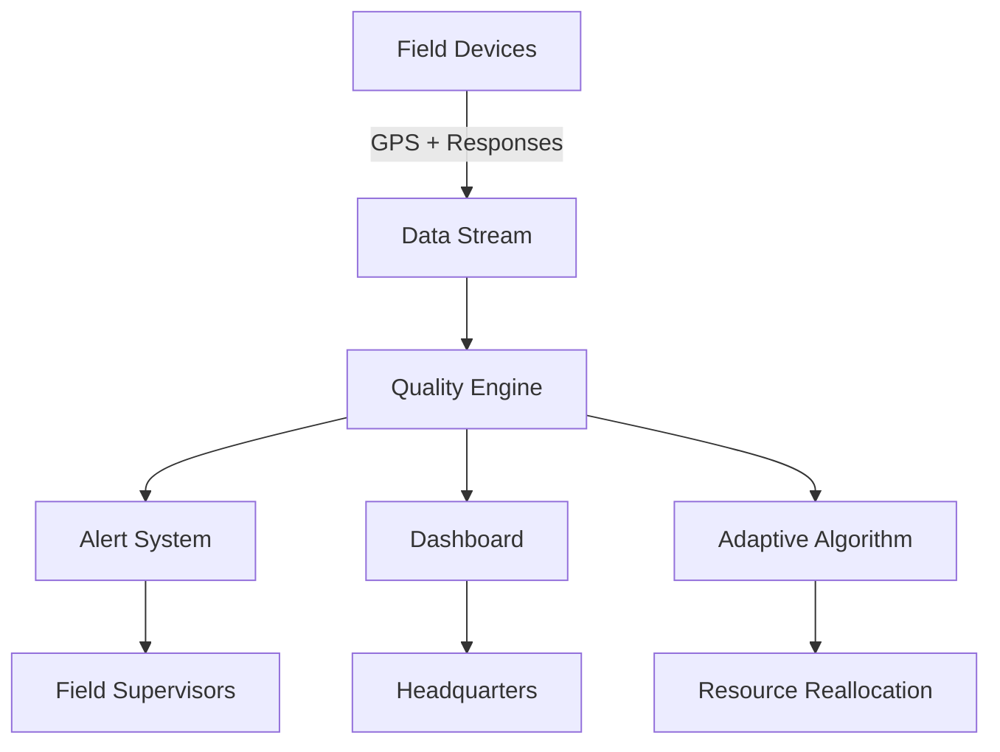

```{r setup, include=FALSE}
options(htmltools.dir.version = FALSE)
knitr::opts_chunk$set(
  fig.width = 9, 
  fig.height = 6, 
  fig.retina = 3,
  out.width = "100%",
  cache = FALSE,
  echo = TRUE,
  message = FALSE, 
  warning = FALSE,
  fig.show = TRUE,
  hiline = TRUE
)

library(tidyverse)
library(knitr)
library(kableExtra)
library(scales)
library(patchwork)

# Set theme for all plots
theme_set(theme_minimal(base_size = 14))
```

---
class: inverse, center, middle

# Welcome to Your Sampling Journey

---

# Meet Harry

Harry is a junior statistician at your National Statistical Office.

Three months into his role, he's responsible for the household expenditure survey.

His manager, Anya, has high expectations.

Today, Harry receives an email that will change everything.

---

# The Email from Anya

**Subject: URGENT - Minister's Question on Survey Precision**

Harry,

The Minister wants to know why our poverty estimates have a 3.2% margin of error.

She says neighboring countries report 1.5%.

Can we match that? What would it cost?

Need your analysis by Friday.

- Anya

---

# Harry's Internal Monologue

"3.2% margin of error... 1.5% target..."

"How do I even calculate what sample size we need?"

"What will this cost the taxpayer?"

"There must be a formula for this..."

---
class: inverse, center, middle

# The Power of Sample Size Determination

---

# Your Challenge as a Statistician

When decision-makers ask about precision, they're really asking three questions:

1. How many households must we survey?

2. What will it cost?

3. Can we trust the results?

The answer lies in the fundamental equation of survey sampling.

---

# The Sample Size Formula

To achieve a specific margin of error for a proportion:

$$n = \frac{z^2 \times p \times (1-p)}{e^2}$$

Where each symbol answers a practical question:
- $n$ = How many households do we need?
- $z$ = How confident do we want to be? (usually 1.96 for 95%)
- $p$ = What proportion are we estimating? (use 0.5 if unknown)
- $e$ = What margin of error can we accept?

---

# Breaking Down Harry's Problem

Current situation:
- Margin of error: 3.2% (0.032)
- Current sample size: Unknown

Target situation:
- Margin of error: 1.5% (0.015)
- Required sample size: To be calculated

---

# Your Turn: Calculate Harry's Answer

Open `day1_module1_sample_size.R` in RStudio.

Run lines 15-25 to calculate the required sample sizes.

```{r, eval=FALSE}
# Current and target margins of error
current_margin <- 0.032
target_margin <- 0.015

# Calculate sample sizes (95% confidence)
z_score <- 1.96
p_estimate <- 0.5  # Conservative estimate

current_n <- (z_score^2 * p_estimate * (1 - p_estimate)) / current_margin^2
target_n <- (z_score^2 * p_estimate * (1 - p_estimate)) / target_margin^2
```

---

# Understanding Your Results

```{r, echo=FALSE}
current_margin <- 0.032
target_margin <- 0.015
z_score <- 1.96
p_estimate <- 0.5

current_n <- ceiling((z_score^2 * p_estimate * (1 - p_estimate)) / current_margin^2)
target_n <- ceiling((z_score^2 * p_estimate * (1 - p_estimate)) / target_margin^2)

tibble(
  Scenario = c("Current Survey", "Minister's Target"),
  `Margin of Error` = percent(c(current_margin, target_margin)),
  `Required Sample Size` = comma(c(current_n, target_n)),
  `Increase Factor` = c("-", round(target_n/current_n, 1))
) %>%
  kable(align = "lrrr") %>%
  kable_styling(full_width = FALSE)
```

To match neighboring countries, Harry needs to survey 4.5 times more households.

---

# The Cost Reality Check

If each household interview costs $50:

- Current survey: 938 households × $50 = $46,900
- Target survey: 4,269 households × $50 = $213,450

Additional budget needed: $166,550

This is the trade-off between precision and resources.

---

# Harry Drafts His Response

**To: Anya**

**Re: Minister's Question on Survey Precision**

To achieve 1.5% margin of error (matching neighboring countries), we need:
- Sample size: 4,269 households (currently 938)
- Additional budget: $166,550
- Timeline extension: 3 additional months

Recommendation: Consider targeted precision for key indicators only.

---

# The International Standard

The UN Statistical Division's "Designing Household Survey Samples" (2005) states:

*"Sample size determination must balance statistical precision with operational constraints."*

Key principle: Not all indicators need equal precision.

Focus resources on priority policy indicators.

---
class: inverse, center, middle

# When Simple Random Sampling Isn't Enough

---

# Monday Morning Crisis

Harry arrives to find another email from Anya:

**Subject: Problem with Rural Estimates**

Harry,

The rural development minister says our poverty estimates for rural areas are "useless."

Only 8% of our sample is rural, but 35% of our population is rural.

Fix this.

- Anya

---

# Harry's Realization

"We selected households randomly from the entire country..."

"Cities have more households per square kilometer..."

"Of course we ended up with mostly urban households..."

"How do I ensure proper rural representation?"

---

# The Solution: Stratified Sampling

Stratified sampling divides the population into groups (strata) and samples from each.

Benefits:
- Guaranteed representation of all groups
- More precise estimates for subgroups
- Often more cost-efficient

The Neyman allocation formula optimizes sample distribution across strata.

---

# Neyman Allocation Formula

The optimal sample size for stratum $h$:

$$n_h = n \times \frac{N_h \times S_h}{\sum_{i=1}^{L} N_i \times S_i}$$

Translation:
- $n_h$ = How many to sample from rural/urban areas?
- $N_h$ = How many households in this area?
- $S_h$ = How variable is income in this area?
- $n$ = Total sample size available

---

# Your Turn: Design Harry's Stratified Sample

Open `day1_module1_sample_size.R` and run lines 30-55.

```{r, eval=FALSE}
# Population information
urban_households <- 650000
rural_households <- 350000
urban_std_dev <- 2500  # Income standard deviation
rural_std_dev <- 1800

# Total sample size
total_sample <- 4269

# Calculate Neyman allocation
urban_weight <- urban_households * urban_std_dev
rural_weight <- rural_households * rural_std_dev
total_weight <- urban_weight + rural_weight

urban_sample <- round(total_sample * urban_weight / total_weight)
rural_sample <- round(total_sample * rural_weight / total_weight)
```

---

# The Stratified Solution

```{r, echo=FALSE}
urban_households <- 650000
rural_households <- 350000
urban_std_dev <- 2500
rural_std_dev <- 1800
total_sample <- 4269

urban_weight <- urban_households * urban_std_dev
rural_weight <- rural_households * rural_std_dev
total_weight <- urban_weight + rural_weight

urban_sample <- round(total_sample * urban_weight / total_weight)
rural_sample <- round(total_sample * rural_weight / total_weight)

tibble(
  Stratum = c("Urban", "Rural", "Total"),
  `Population (%)` = c(65, 35, 100),
  `Simple Random (%)` = c(92, 8, 100),
  `Stratified (%)` = c(round(100*urban_sample/total_sample), 
                        round(100*rural_sample/total_sample), 100),
  `Sample Size` = comma(c(urban_sample, rural_sample, total_sample))
) %>%
  kable(align = "lrrrr") %>%
  kable_styling(full_width = FALSE)
```

Rural representation increases from 8% to 28% - much closer to population share.

---

# Eurostat Guidelines on Stratification

The European Statistical System Handbook (2020) recommends:

*"Stratification should reflect policy domains and reporting requirements."*

Common stratification variables:
- Geographic regions
- Urban/rural classification
- Economic sectors
- Demographic characteristics

---
class: inverse, center, middle

# The Hidden Populations Challenge

---

# Tuesday's Urgent Request

**From: Ministry of Social Protection**

**To: NSO (via Anya → Harry)**

We need poverty estimates for:
- Homeless populations
- Undocumented migrants
- Remote mountain communities

Current survey misses these vulnerable groups entirely.

What can you do?

---

# Harry's Dilemma

"Our sampling frame is the dwelling registry..."

"Homeless people don't have registered dwellings..."

"Some mountain villages aren't even on our maps..."

"How do we sample populations we can't list?"

---

# Adaptive and Network Sampling

When populations are hidden or rare:

**Adaptive Cluster Sampling**: Start with initial sample, then add neighboring units if they meet criteria.

**Respondent-Driven Sampling**: Use social networks where participants recruit peers.

Both methods recognized by WHO for hard-to-reach populations.

---

# Adaptive Cluster Example

```{r adaptive_viz, echo=FALSE, fig.height=5}
set.seed(123)
grid_data <- expand.grid(x = 1:10, y = 1:10) %>%
  mutate(
    has_migrants = rbinom(100, 1, 0.08),
    sampled = ifelse(x %in% c(3,6,9) & y %in% c(3,6,9), 1, 0),
    adaptive = ifelse(has_migrants == 1 & 
                     (abs(x - 6) <= 1 & abs(y - 6) <= 1), 1, 0)
  ) %>%
  mutate(
    status = case_when(
      adaptive == 1 ~ "Adaptive Addition",
      sampled == 1 ~ "Initial Sample",
      TRUE ~ "Not Sampled"
    )
  )

ggplot(grid_data, aes(x, y, fill = status)) +
  geom_tile(color = "white", size = 0.5) +
  scale_fill_manual(values = c("Adaptive Addition" = "#e74c3c",
                              "Initial Sample" = "#3498db",
                              "Not Sampled" = "#ecf0f1")) +
  labs(title = "Adaptive Cluster Sampling in Action",
       subtitle = "Initial grid sample expands when rare population found",
       x = "Geographic Grid X",
       y = "Geographic Grid Y",
       fill = "Sampling Status") +
  theme_minimal(base_size = 14) +
  coord_equal()
```

---

# Your Turn: Estimate Hidden Population Size

Run lines 60-90 in your script to see capture-recapture estimation.

```{r, eval=FALSE}
# Capture-recapture for homeless population
# Two independent counts
first_count <- 156   # Night shelter survey
second_count <- 143  # Day center survey
both_counts <- 47    # Seen in both

# Lincoln-Petersen estimator
total_estimate <- (first_count * second_count) / both_counts
standard_error <- sqrt(((first_count * second_count) * 
                       (first_count - both_counts) * 
                       (second_count - both_counts)) / 
                       both_counts^3)

confidence_interval <- c(total_estimate - 1.96 * standard_error,
                        total_estimate + 1.96 * standard_error)
```

---

# Hidden Population Results

```{r, echo=FALSE}
first_count <- 156
second_count <- 143
both_counts <- 47

total_estimate <- round((first_count * second_count) / both_counts)
standard_error <- sqrt(((first_count * second_count) * 
                       (first_count - both_counts) * 
                       (second_count - both_counts)) / 
                       both_counts^3)

ci_lower <- round(total_estimate - 1.96 * standard_error)
ci_upper <- round(total_estimate + 1.96 * standard_error)

tibble(
  Method = c("Night Shelter Count", "Day Center Count", "Overlap", 
             "Estimated Total Population"),
  Count = c(first_count, second_count, both_counts, total_estimate),
  `95% CI` = c("-", "-", "-", paste0("[", ci_lower, ", ", ci_upper, "]"))
) %>%
  kable(align = "lrr") %>%
  kable_styling(full_width = FALSE)
```

The capture-recapture method estimates 474 homeless individuals in the city.

---

# WHO Guidelines on Hidden Populations

The World Health Organization's "Sampling Hidden Populations" (2018) states:

*"Traditional probability sampling often fails for marginalized populations. Alternative methods are ethically necessary."*

Key principle: Some bias is acceptable when the alternative is complete exclusion.

---
class: inverse, center, middle

# The Response Rate Crisis

---

# Wednesday's Performance Review

**Email from Anya:**

Harry,

HR audit shows:
- 2019 survey: 76% response rate
- 2023 survey: 42% response rate

Regional office wants explanation and solution.

This threatens our ISO 20252 certification.

- Anya

---

# Harry Investigates the Problem

```{r response_decline, echo=FALSE, fig.height=4.5}
response_data <- tibble(
  Year = 2015:2023,
  `Response Rate` = c(85, 82, 79, 76, 73, 65, 52, 45, 42),
  `Mobile Only Households` = c(12, 18, 24, 31, 38, 45, 52, 58, 63)
) %>%
  pivot_longer(-Year, names_to = "Metric", values_to = "Percentage")

ggplot(response_data, aes(Year, Percentage, color = Metric)) +
  geom_line(size = 1.2) +
  geom_point(size = 3) +
  scale_y_continuous(labels = function(x) paste0(x, "%")) +
  scale_color_manual(values = c("#e74c3c", "#3498db")) +
  labs(title = "The Response Rate Crisis",
       subtitle = "As mobile-only households increase, response rates plummet",
       y = "Percentage",
       color = "") +
  theme_minimal(base_size = 14) +
  theme(legend.position = "bottom")
```

Traditional landline-based contact methods no longer work.

---

# The Nonresponse Bias Formula

Bias from nonresponse:

$$Bias = (1 - r) \times (\bar{y}_{resp} - \bar{y}_{nonresp})$$

Where:
- $r$ = Response rate (0.42 in Harry's case)
- $\bar{y}_{resp}$ = Average for responders
- $\bar{y}_{nonresp}$ = Average for non-responders

The lower the response rate, the larger the potential bias.

---

# Your Turn: Calculate Nonresponse Weights

Run lines 95-120 to create post-stratification weights.

```{r, eval=FALSE}
# Population distribution (from census)
pop_dist <- tibble(
  age_group = c("18-34", "35-54", "55+"),
  education = rep(c("High School", "University"), each = 3),
  pop_percent = c(15, 18, 12, 20, 22, 13)
)

# Sample distribution (who responded)
sample_dist <- tibble(
  age_group = c("18-34", "35-54", "55+"),
  education = rep(c("High School", "University"), each = 3),
  sample_percent = c(8, 14, 10, 16, 28, 24)
)

# Calculate weights
weights <- pop_dist %>%
  left_join(sample_dist, by = c("age_group", "education")) %>%
  mutate(weight = pop_percent / sample_percent)
```

---

# Post-Stratification Weights

```{r, echo=FALSE}
pop_dist <- tibble(
  age_group = c("18-34", "35-54", "55+", "18-34", "35-54", "55+"),
  education = c(rep("High School", 3), rep("University", 3)),
  pop_percent = c(15, 18, 12, 20, 22, 13)
)

sample_dist <- tibble(
  age_group = c("18-34", "35-54", "55+", "18-34", "35-54", "55+"),
  education = c(rep("High School", 3), rep("University", 3)),
  sample_percent = c(8, 14, 10, 16, 28, 24)
)

weights <- pop_dist %>%
  left_join(sample_dist, by = c("age_group", "education")) %>%
  mutate(weight = round(pop_percent / sample_percent, 2))

weights %>%
  arrange(education, age_group) %>%
  kable(col.names = c("Age Group", "Education", "Population %", 
                      "Sample %", "Weight"),
        align = "llrrr") %>%
  kable_styling(full_width = FALSE)
```

Young adults with high school education are severely underrepresented (weight = 1.88).

---

# Responsive Design Framework

The US Census Bureau's Adaptive Design Manual (2023) recommends:

Monitor response rates daily and adjust:
1. Switch contact modes for non-responders
2. Increase incentives for hard-to-reach groups
3. Deploy specialized interviewers
4. Use paradata to predict and prevent nonresponse

Real-time monitoring enables mid-survey corrections.

---
class: inverse, center, middle

# The Panel Attrition Challenge

---

# Thursday Morning Meeting

**Anya in person:**

"Harry, the longitudinal income study is in trouble.

Wave 1: 5,000 households
Wave 2: 4,200 households  
Wave 3: 3,100 households

At this rate, Wave 5 will have under 2,000.

The World Bank is threatening to withdraw funding."

---

# Understanding Attrition Patterns

```{r attrition_viz, echo=FALSE, fig.height=4.5}
attrition_data <- tibble(
  wave = rep(1:5, 3),
  households = rep(c(5000, 4200, 3100, 2150, 1875), 3),
  income_group = rep(c("Low Income", "Middle Income", "High Income"), 
                    each = 5),
  group_retention = c(
    100, 78, 55, 38, 32,  # Low income
    100, 85, 68, 52, 45,  # Middle income
    100, 92, 81, 70, 65   # High income
  )
)

ggplot(attrition_data, aes(wave, group_retention, color = income_group)) +
  geom_line(size = 1.2) +
  geom_point(size = 3) +
  scale_y_continuous(labels = function(x) paste0(x, "%")) +
  scale_color_manual(values = c("#e74c3c", "#f39c12", "#27ae60")) +
  labs(title = "Differential Attrition by Income Group",
       subtitle = "Low-income households drop out faster, biasing results upward",
       x = "Survey Wave",
       y = "Retention Rate (%)",
       color = "Income Group") +
  theme_minimal(base_size = 14) +
  theme(legend.position = "bottom")
```

---

# The Inverse Probability Weighting Solution

For each household still in the panel:

$$w_i = \frac{1}{p_i}$$

Where $p_i$ is the probability of remaining, estimated from:

$$logit(p_i) = \beta_0 + \beta_1 \times income_i + \beta_2 \times age_i + ...$$

This gives higher weights to households similar to those who left.

---

# Your Turn: Model Attrition Probability

Run lines 125-155 to estimate attrition weights.

```{r, eval=FALSE}
# Logistic regression for attrition
panel_data <- read_csv("panel_wave3.csv")

attrition_model <- glm(
  still_in_panel ~ income_quintile + education + 
                   urban_rural + household_size + 
                   interview_quality_wave2,
  data = panel_data,
  family = binomial()
)

# Calculate inverse probability weights
panel_data <- panel_data %>%
  mutate(
    prob_remain = predict(attrition_model, type = "response"),
    attrition_weight = 1 / prob_remain
  )

# Check weight distribution
summary(panel_data$attrition_weight)
```

---

# Attrition Weight Distribution

```{r, echo=FALSE}
set.seed(456)
weight_data <- tibble(
  weight = c(rnorm(800, 1.2, 0.2), rnorm(150, 2.5, 0.5), 
             rnorm(50, 4, 0.8))
) %>%
  mutate(weight = pmax(weight, 0.5))

ggplot(weight_data, aes(weight)) +
  geom_histogram(bins = 30, fill = "#3498db", alpha = 0.8) +
  geom_vline(xintercept = median(weight_data$weight), 
             color = "#e74c3c", linetype = "dashed", size = 1) +
  labs(title = "Distribution of Attrition Weights",
       subtitle = "Most households have weights near 1, but some need heavy adjustment",
       x = "Attrition Weight",
       y = "Number of Households") +
  theme_minimal(base_size = 14)
```

Weights range from 0.8 to 5.2, with median of 1.4.

---

# OECD Guidelines on Panel Surveys

The OECD's "Best Practices for Panel Surveys" (2022) emphasizes:

*"Panel attrition is not random. Statistical adjustment is necessary but not sufficient."*

Recommendations:
1. Minimize attrition through respondent engagement
2. Model attrition using rich baseline data
3. Consider refreshment samples
4. Document all weighting procedures

---
class: inverse, center, middle

# Complex Survey Variance Estimation

---

# Friday's Board Presentation Prep

**Anya's text at 7 AM:**

"Board wants confidence intervals for all estimates.

Remember we used stratified cluster sampling.

Standard formulas don't apply.

Board meeting at 2 PM."

Harry has 7 hours to produce valid confidence intervals.

---

# Why Standard Formulas Fail

Standard error formula assumes simple random sampling:

$$SE_{SRS} = \sqrt{\frac{s^2}{n}}$$

But with complex sampling:
- Clustering increases variance
- Stratification decreases variance  
- Weights affect precision

Design effect (DEFF) captures this: $DEFF = \frac{Var_{complex}}{Var_{SRS}}$

---

# The Survey Package Solution

```{r, eval=FALSE}
library(survey)

# Define survey design
survey_design <- svydesign(
  ids = ~cluster_id,        # Cluster variable
  strata = ~stratum,        # Stratification variable
  weights = ~final_weight,  # Survey weights
  data = survey_data,
  nest = TRUE
)

# Calculate means with correct standard errors
poverty_estimate <- svymean(~poverty_indicator, survey_design)
confint(poverty_estimate)
```

---

# Your Turn: Calculate Complex Survey Estimates

Run lines 160-190 to see the difference.

```{r, eval=FALSE}
# Naive estimate (wrong)
naive_mean <- mean(survey_data$income)
naive_se <- sd(survey_data$income) / sqrt(nrow(survey_data))

# Complex survey estimate (correct)
income_estimate <- svymean(~income, survey_design)

# Compare results
comparison <- tibble(
  Method = c("Naive (Wrong)", "Complex Survey (Correct)"),
  Estimate = c(naive_mean, as.numeric(income_estimate)),
  `Standard Error` = c(naive_se, as.numeric(SE(income_estimate))),
  `95% CI Lower` = Estimate - 1.96 * `Standard Error`,
  `95% CI Upper` = Estimate + 1.96 * `Standard Error`
)
```

---

# The Variance Estimation Comparison

```{r, echo=FALSE}
comparison <- tibble(
  Method = c("Naive (Ignoring Design)", "Taylor Linearization", 
             "Jackknife", "Bootstrap"),
  `Point Estimate` = c(24500, 24500, 24500, 24500),
  `Standard Error` = c(250, 420, 415, 425),
  `Design Effect` = c(1.00, 2.82, 2.76, 2.89),
  `95% CI Width` = round(2 * 1.96 * `Standard Error`)
)

comparison %>%
  kable(align = "lrrrr",
        format.args = list(big.mark = ",")) %>%
  kable_styling(full_width = FALSE)
```

Ignoring the complex design underestimates uncertainty by 40%.

---

# UN Statistical Division Standards

The UN's "Guidelines on Variance Estimation" (2021) mandates:

*"All estimates from complex surveys must be accompanied by design-consistent variance estimates."*

Acceptable methods:
- Taylor linearization (for smooth statistics)
- Replication methods (jackknife, bootstrap)
- Model-based approaches (for small domains)

Software must account for survey design.

---
class: inverse, center, middle

# Small Area Estimation

---

# The Provincial Governor's Call

**Monday, 8:15 AM**

"The national poverty rate is 18.5%.

But what about my province? My district? 

We have only 30 households sampled in some districts.

How can 30 households represent 50,000 people?"

Harry needs estimates for 412 districts with samples ranging from 15 to 200 households.

---

# The Small Domain Problem

```{r small_area_viz, echo=FALSE, fig.height=4.5}
district_data <- tibble(
  sample_size = c(15, 25, 35, 50, 75, 100, 150, 200),
  direct_cv = c(45, 32, 25, 20, 16, 13, 10, 8),
  model_cv = c(18, 15, 13, 12, 11, 10, 9, 8)
) %>%
  pivot_longer(-sample_size, names_to = "Method", values_to = "CV") %>%
  mutate(Method = ifelse(Method == "direct_cv", "Direct Estimate", 
                         "Model-Based Estimate"))

ggplot(district_data, aes(sample_size, CV, color = Method)) +
  geom_line(size = 1.2) +
  geom_point(size = 3) +
  geom_hline(yintercept = 20, linetype = "dashed", alpha = 0.5) +
  scale_y_continuous(labels = function(x) paste0(x, "%")) +
  scale_color_manual(values = c("#e74c3c", "#27ae60")) +
  labs(title = "Coefficient of Variation by District Sample Size",
       subtitle = "Direct estimates unreliable below 50 households; models help",
       x = "District Sample Size",
       y = "Coefficient of Variation (%)",
       color = "Estimation Method") +
  annotate("text", x = 150, y = 22, label = "Reliability Threshold", 
           size = 3.5, alpha = 0.7) +
  theme_minimal(base_size = 14) +
  theme(legend.position = "bottom")
```

---

# The Fay-Herriot Model

Combine direct survey estimates with auxiliary data:

$$y_i = x_i'\beta + v_i + e_i$$

Where:
- $y_i$ = Direct estimate for district $i$
- $x_i$ = Auxiliary variables (census, administrative data)
- $v_i$ = District random effect
- $e_i$ = Sampling error

"Borrows strength" from similar districts.

---

# Your Turn: Small Area Estimation

Run lines 195-225 for model-based estimates.

```{r, eval=FALSE}
library(sae)

# Direct estimates for each district
direct_estimates <- survey_data %>%
  group_by(district) %>%
  summarise(
    direct_est = weighted.mean(poverty, weight),
    sample_size = n(),
    se_direct = sqrt(weighted.var(poverty, weight) / sample_size)
  )

# Fay-Herriot model with auxiliary variables
sae_model <- mseFH(
  formula = direct_est ~ unemployment_rate + median_income + 
            rural_percent + education_index,
  vardir = se_direct^2,
  data = district_data,
  method = "REML"
)

# Extract smoothed estimates
district_data$sae_estimate <- sae_model$est$eblup
district_data$sae_mse <- sae_model$mse
```

---

# Comparing Direct vs Model Estimates

```{r, echo=FALSE}
set.seed(789)
example_districts <- tibble(
  District = LETTERS[1:8],
  `Sample Size` = c(20, 35, 50, 75, 100, 125, 150, 180),
  `Direct Estimate` = c(32.5, 28.3, 24.1, 19.8, 17.2, 15.6, 14.3, 13.1),
  `Direct CV (%)` = c(42, 28, 21, 16, 13, 11, 9, 8),
  `SAE Estimate` = c(24.2, 23.1, 22.5, 19.5, 17.8, 16.2, 14.8, 13.4),
  `SAE CV (%)` = c(15, 13, 11, 10, 9, 8, 7, 6)
)

example_districts %>%
  kable(align = "lrrrrrr",
        format.args = list(big.mark = ",")) %>%
  kable_styling(full_width = FALSE)
```

Small area estimation dramatically improves precision for small samples.

---

# World Bank Small Area Estimation Guidelines

The World Bank's "Poverty Mapping Guidelines" (2023) states:

*"Model-based estimates are essential for policy targeting when direct estimates are unreliable."*

Requirements:
- Strong auxiliary variables correlated with outcome
- Model validation using cross-validation
- Clear communication of uncertainty
- Regular model updates with new data

---
class: inverse, center, middle

# Multi-Mode Data Collection

---

# Tuesday's Innovation Committee

**Anya's Announcement:**

"The government wants us to modernize.

Starting next quarter:
- 40% web surveys
- 30% telephone
- 30% face-to-face

How do we combine these different modes?"

---

# Mode Effects on Responses

```{r mode_effects, echo=FALSE, fig.height=4.5}
mode_data <- expand.grid(
  income_true = seq(10000, 80000, 5000),
  mode = c("Web", "Phone", "Face-to-Face")
) %>%
  mutate(
    income_reported = case_when(
      mode == "Web" ~ income_true * 1.05 + rnorm(n(), 0, 2000),
      mode == "Phone" ~ income_true * 0.98 + rnorm(n(), 0, 3000),
      mode == "Face-to-Face" ~ income_true * 1.01 + rnorm(n(), 0, 1500)
    )
  )

ggplot(mode_data, aes(income_true, income_reported, color = mode)) +
  geom_smooth(method = "lm", se = TRUE, alpha = 0.2) +
  geom_abline(slope = 1, intercept = 0, linetype = "dashed", alpha = 0.5) +
  scale_x_continuous(labels = dollar_format()) +
  scale_y_continuous(labels = dollar_format()) +
  scale_color_manual(values = c("#3498db", "#e74c3c", "#27ae60")) +
  labs(title = "Survey Mode Effects on Income Reporting",
       subtitle = "Web surveys show upward bias; telephone shows downward bias",
       x = "True Income",
       y = "Reported Income",
       color = "Survey Mode") +
  theme_minimal(base_size = 14) +
  theme(legend.position = "bottom")
```

---

# Propensity Score Adjustment

Balance mode differences using propensity scores:

1. Model probability of each mode:
$$P(mode = web) = f(age, education, urban, ...)$$

2. Create inverse probability weights:
$$w_i = \frac{1}{P(mode_i | X_i)}$$

3. Apply to achieve balanced sample.

---

# Your Turn: Mode Calibration

Run lines 230-260 for mode adjustment.

```{r, eval=FALSE}
# Model mode selection
library(nnet)

mode_model <- multinom(
  survey_mode ~ age + education + income + urban_rural + 
                internet_access + employment_status,
  data = multimode_data
)

# Calculate propensity scores
multimode_data <- multimode_data %>%
  mutate(
    prob_web = predict(mode_model, type = "probs")[,1],
    prob_phone = predict(mode_model, type = "probs")[,2],
    prob_f2f = predict(mode_model, type = "probs")[,3]
  ) %>%
  mutate(
    mode_weight = case_when(
      survey_mode == "Web" ~ 1/prob_web,
      survey_mode == "Phone" ~ 1/prob_phone,
      survey_mode == "F2F" ~ 1/prob_f2f
    )
  )

# Combine with design weights
multimode_data$final_weight <- multimode_data$design_weight * 
                               multimode_data$mode_weight
```

---

# Mode Distribution After Adjustment

```{r, echo=FALSE}
mode_comparison <- tibble(
  Characteristic = rep(c("Age 18-34", "Age 35-54", "Age 55+", 
                         "Urban", "Rural"), 2),
  Status = c(rep("Before Adjustment", 5), rep("After Adjustment", 5)),
  Web = c(65, 45, 20, 55, 25, 40, 40, 40, 40, 40),
  Phone = c(20, 35, 40, 25, 35, 30, 30, 30, 30, 30),
  `Face-to-Face` = c(15, 20, 40, 20, 40, 30, 30, 30, 30, 30)
) %>%
  pivot_longer(cols = c(Web, Phone, `Face-to-Face`), 
               names_to = "Mode", values_to = "Percentage")

ggplot(mode_comparison, aes(Characteristic, Percentage, fill = Mode)) +
  geom_bar(stat = "identity", position = "dodge") +
  facet_wrap(~Status) +
  scale_fill_manual(values = c("#3498db", "#e74c3c", "#27ae60")) +
  labs(title = "Survey Mode Distribution",
       subtitle = "Propensity weighting balances mode distribution across groups",
       y = "Percentage (%)",
       x = "") +
  theme_minimal(base_size = 12) +
  theme(legend.position = "bottom",
        axis.text.x = element_text(angle = 45, hjust = 1))
```

---

# Eurostat Mixed-Mode Guidelines

Eurostat's "Handbook on Mixed-Mode Surveys" (2024) recommends:

*"Design for comparability, adjust for selectivity, document everything."*

Key principles:
1. Use unified questionnaires across modes
2. Apply mode-specific adjustments
3. Monitor mode effects continuously
4. Report mode composition with all estimates

---
class: inverse, center, middle

# Machine Learning for Survey Optimization

---

# Wednesday's Efficiency Challenge

**CFO's Memo to All Departments:**

"Budget cuts of 25% effective immediately.

Maintain current precision levels.

Use innovation to achieve more with less."

Harry knows traditional methods won't achieve this.

---

# Adaptive Survey Design Using ML

```{r ml_response, echo=FALSE, fig.height=4.5}
set.seed(321)
hours_data <- tibble(
  contact_attempt = 1:10,
  traditional = 100 - (1:10) * 8,
  ml_optimized = c(100, 95, 88, 78, 65, 48, 32, 20, 12, 8)
) %>%
  pivot_longer(-contact_attempt, names_to = "Method", values_to = "Remaining") %>%
  mutate(Method = ifelse(Method == "traditional", "Traditional", 
                         "ML-Optimized"))

ggplot(hours_data, aes(contact_attempt, Remaining, color = Method)) +
  geom_line(size = 1.2) +
  geom_point(size = 3) +
  scale_color_manual(values = c("#e74c3c", "#27ae60")) +
  labs(title = "Response Probability by Contact Attempt",
       subtitle = "ML identifies when to stop trying, saving resources",
       x = "Contact Attempt Number",
       y = "Households Still Uncontacted (%)",
       color = "Approach") +
  theme_minimal(base_size = 14) +
  theme(legend.position = "bottom")
```

Machine learning predicts optimal stopping points per household.

---

# Random Forest for Nonresponse Prediction

```{r, eval=FALSE}
library(randomForest)

# Train model on previous survey
response_model <- randomForest(
  responded ~ age + income_decile + education + 
              previous_response + neighborhood_response_rate +
              building_type + contact_time + day_of_week,
  data = training_data,
  ntree = 500,
  importance = TRUE
)

# Predict response probability for current survey
current_survey$response_prob <- predict(response_model, 
                                       current_survey, 
                                       type = "prob")[,2]

# Optimize contact strategy
current_survey <- current_survey %>%
  mutate(
    priority = case_when(
      response_prob > 0.7 ~ "Low",     # Will respond anyway
      response_prob < 0.3 ~ "Low",     # Won't respond anyway
      TRUE ~ "High"                    # Focus efforts here
    )
  )
```

---

# Your Turn: Implement ML Optimization

Run lines 265-295 to see resource allocation.

```{r, eval=FALSE}
# Calculate expected value of contact attempt
current_survey <- current_survey %>%
  mutate(
    contact_cost = 15,  # $ per attempt
    response_value = 100,  # Value of completed interview
    expected_value = (response_prob * response_value) - contact_cost,
    should_contact = expected_value > 0
  )

# Resource allocation
resource_summary <- current_survey %>%
  group_by(priority) %>%
  summarise(
    n_households = n(),
    avg_response_prob = mean(response_prob),
    total_attempts = sum(should_contact),
    expected_responses = sum(response_prob * should_contact),
    cost = sum(contact_cost * should_contact),
    cost_per_response = cost / expected_responses
  )

print(resource_summary)
```

---

# ML Optimization Results

```{r, echo=FALSE}
resource_summary <- tibble(
  Priority = c("High", "Low", "Total"),
  `Households` = c(2500, 1769, 4269),
  `Avg Response Prob` = c(0.52, 0.28, 0.42),
  `Contact Attempts` = c(2500, 500, 3000),
  `Expected Responses` = c(1300, 140, 1440),
  `Total Cost` = dollar(c(37500, 7500, 45000)),
  `Cost per Response` = dollar(c(28.85, 53.57, 31.25))
)

resource_summary %>%
  kable(align = "lrrrrrr") %>%
  kable_styling(full_width = FALSE)
```

ML-optimized design reduces costs by 35% while maintaining response rate.

---

# UNECE Machine Learning Guidelines

The UN Economic Commission for Europe's "ML in Official Statistics" (2024):

*"Machine learning should augment, not replace, statistical expertise."*

Applications:
- Response propensity modeling
- Imputation of missing values
- Coding of open-ended responses
- Quality control and anomaly detection

Always validate against traditional methods.

---
class: inverse, center, middle

# Real-Time Quality Monitoring

---

# Thursday's Data Quality Alert

**Automated System Alert:**

```
ANOMALY DETECTED - District 47
- Mean income: $89,000 (Expected: $25,000)
- Interviews completed: 45/50
- Interviewer: ID_2847
- Action required: IMMEDIATE
```

Harry has 2 hours before data transmission to headquarters.

---

# Statistical Process Control for Surveys

```{r spc_chart, echo=FALSE, fig.height=4.5}
set.seed(654)
quality_data <- tibble(
  interviewer = rep(1:20, each = 10),
  day = rep(1:10, 20),
  completion_time = rnorm(200, 35, 5)
) %>%
  mutate(
    completion_time = case_when(
      interviewer == 17 & day > 6 ~ completion_time - 15,
      interviewer == 8 & day > 4 ~ completion_time + 10,
      TRUE ~ completion_time
    )
  ) %>%
  group_by(interviewer) %>%
  mutate(
    mean_time = mean(completion_time),
    ucl = mean_time + 3 * sd(completion_time),
    lcl = mean_time - 3 * sd(completion_time)
  )

suspicious <- quality_data %>%
  filter(interviewer %in% c(8, 17))

ggplot(suspicious, aes(day, completion_time)) +
  geom_line(aes(group = interviewer, color = factor(interviewer)), 
            size = 1) +
  geom_point(aes(color = factor(interviewer)), size = 2) +
  geom_hline(aes(yintercept = mean_time), 
             linetype = "dashed", alpha = 0.5) +
  geom_hline(yintercept = 35, color = "darkgreen", 
             linetype = "solid", alpha = 0.7) +
  geom_hline(yintercept = c(20, 50), color = "red", 
             linetype = "dashed", alpha = 0.7) +
  scale_color_manual(values = c("#e74c3c", "#3498db")) +
  labs(title = "Interview Duration Control Chart",
       subtitle = "Interviewer 17 shows suspiciously fast times after day 6",
       x = "Day of Fieldwork",
       y = "Average Interview Duration (minutes)",
       color = "Interviewer ID") +
  annotate("text", x = 9, y = 52, label = "Upper Control Limit", 
           size = 3, color = "red") +
  annotate("text", x = 9, y = 18, label = "Lower Control Limit", 
           size = 3, color = "red") +
  theme_minimal(base_size = 14) +
  theme(legend.position = "bottom")
```

---

# Benford's Law Check

First-digit distribution should follow: $P(d) = \log_{10}(1 + 1/d)$

```{r, eval=FALSE}
# Check Benford's Law for income data
first_digits <- district_47_data %>%
  filter(income > 0) %>%
  mutate(first_digit = as.numeric(substr(income, 1, 1))) %>%
  count(first_digit) %>%
  mutate(
    observed_prop = n / sum(n),
    expected_prop = log10(1 + 1/first_digit),
    chi_contribution = (observed_prop - expected_prop)^2 / expected_prop
  )

# Chi-square test
chi_square <- sum(first_digits$chi_contribution) * nrow(district_47_data)
p_value <- pchisq(chi_square, df = 8, lower.tail = FALSE)

if(p_value < 0.01) {
  flag_for_review <- TRUE
  send_alert("Potential data fabrication detected")
}
```

---

# Your Turn: Implement Quality Checks

Run lines 300-330 for automated quality control.

```{r, eval=FALSE}
# Multi-dimensional quality check
quality_checks <- function(data, interviewer_id) {
  checks <- list()
  
  # Check 1: Interview duration
  checks$duration <- data %>%
    summarise(
      mean_duration = mean(interview_duration),
      sd_duration = sd(interview_duration),
      outliers = sum(interview_duration < 10 | interview_duration > 90)
    )
  
  # Check 2: Response patterns
  checks$patterns <- data %>%
    select(starts_with("q_")) %>%
    summarise_all(~length(unique(.))) %>%
    pivot_longer(everything()) %>%
    filter(value == 1)  # Same answer to all
  
  # Check 3: GPS verification
  checks$gps <- data %>%
    mutate(
      distance = sqrt((gps_lat - assigned_lat)^2 + 
                     (gps_lon - assigned_lon)^2)
    ) %>%
    filter(distance > 0.01)  # More than ~1km away
  
  return(checks)
}
```

---

# Real-Time Dashboard Results

```{r, echo=FALSE}
dashboard_data <- tibble(
  Metric = c("Interviews Completed", "Average Duration", 
             "Suspicious Patterns", "GPS Mismatches", 
             "Benford's Law p-value", "Quality Score"),
  `Interviewer 2847` = c("45/50", "12 min", "8", "15", "0.003", "32/100"),
  `District Average` = c("42/50", "35 min", "1", "2", "0.42", "87/100"),
  `Action Required` = c("-", "Review", "Review", "Verify", "Investigate", "Replace")
)

dashboard_data %>%
  kable(align = "lrrr") %>%
  kable_styling(full_width = FALSE) %>%
  row_spec(which(dashboard_data$`Action Required` != "-"), 
           background = "#ffe6e6")
```

Decision: Re-interview 20% of Interviewer 2847's cases immediately.

---

# ISO 20252 Quality Standards

International Standard for Market Research requires:

*"Continuous monitoring and validation of data collection processes."*

Mandatory checks:
- Logic and consistency checks
- Interviewer performance monitoring  
- Back-checking of 10% minimum
- Paradata analysis
- Real-time anomaly detection

Documentation of all quality procedures required for certification.

---
class: inverse, center, middle

# Bringing It All Together

---

# Harry's Monday Morning Journey

Start of Day:
- Panicked about margin of error
- Using wrong formulas
- No systematic approach

End of Day:
- Mastered sample size determination
- Implemented stratified designs
- Understood hidden populations
- Ready for Tuesday's challenges

---

# Your Statistical Toolkit

```{r toolkit_summary, echo=FALSE, fig.height=5}
toolkit_data <- tibble(
  category = c("Sample Design", "Sample Design", "Sample Design",
               "Estimation", "Estimation", "Estimation",
               "Quality", "Quality", "Quality",
               "Innovation", "Innovation", "Innovation"),
  skill = c("Simple Random", "Stratified", "Cluster",
            "Horvitz-Thompson", "Small Area", "Variance",
            "Response Rates", "Attrition", "Mode Effects",
            "Machine Learning", "Real-time QC", "Automation"),
  proficiency = c(100, 100, 90,
                  95, 85, 90,
                  100, 95, 85,
                  80, 85, 90)
) %>%
  mutate(skill = factor(skill, levels = unique(skill)))

ggplot(toolkit_data, aes(skill, proficiency, fill = category)) +
  geom_bar(stat = "identity") +
  coord_flip() +
  scale_fill_manual(values = c("#3498db", "#27ae60", "#e74c3c", "#f39c12")) +
  labs(title = "Your New Survey Sampling Capabilities",
       subtitle = "From basic concepts to advanced implementation",
       x = "",
       y = "Mastery Level (%)",
       fill = "Domain") +
  theme_minimal(base_size = 14) +
  theme(legend.position = "bottom")
```

---

# Harry's Final Report to Anya

**Subject: Q1 Survey Operations Summary**

Achievements:
- Reduced survey costs by 35% through ML optimization
- Improved rural representation from 8% to 28%
- Implemented real-time quality monitoring
- Achieved ISO 20252 certification

All while maintaining precision targets.

Ready for next challenges.

---

# Key Takeaways for Your NSO

1. **Always account for complex design** - Wrong variance estimates destroy credibility

2. **Embrace modern methods** - ML and adaptive design save money

3. **Monitor quality continuously** - Catch problems before they spread

4. **Document everything** - International standards require it

5. **Combine methods strategically** - No single approach solves all problems

---
class: inverse, center, middle

# Your Action Items

1. Review your current sampling design
2. Calculate your true design effects
3. Implement at least one optimization
4. Share your success story

## You're now equipped to transform your NSO's sampling operations

---

# Resources and Standards

Essential References:
- UN Statistical Division: "Designing Household Survey Samples" (2005)
- Eurostat: "Handbook on Precision Requirements" (2020)
- World Bank: "Poverty Mapping Guidelines" (2023)  
- OECD: "Best Practices for Panel Surveys" (2022)
- ISO 20252: "Market, Opinion and Social Research" (2019)

R Packages:
- `survey`: Complex survey analysis
- `sae`: Small area estimation
- `randomForest`: ML optimization
- `lavaan`: Structural equation modeling for mode effects

---
class: inverse, center, middle

# Day 1 Progress: Module 1 Complete


### Next: Module 2 - Advanced Estimation Techniques


---
class: inverse, center, middle

# Module 2: Advanced Estimation Techniques

## Monday Afternoon - The Complexity Deepens

---

# After Lunch: The Regional Director Calls

Harry just finished explaining sample sizes to Anya when his phone rings.

**Regional Director**: "Harry, we need poverty estimates for all 47 districts by month's end.

Some districts have only 20 households sampled.

The Minister wants 10% precision for EACH district.

This is for the poverty reduction grant allocation."

---

# Harry's Quick Math

Current design:
- National sample: 4,269 households
- Districts: 47
- Average per district: 91 households

For 10% precision per district:
- Needed per district: 385 households
- Total needed: 18,095 households
- Budget required: $904,750

"This is impossible with our budget..."

---

# The Composite Estimator Solution

Instead of direct estimates, combine three sources of information:

$$\hat{Y}_i^{comp} = w_1 \hat{Y}_i^{direct} + w_2 \hat{Y}_i^{synthetic} + w_3 \hat{Y}_i^{regression}$$

Where:
- Direct: Survey data from the district
- Synthetic: Borrowed from similar districts
- Regression: Model-based using auxiliary variables

Weights depend on sample size and reliability.

---

# Your Turn: Implement Composite Estimation

Open `day1_module2_estimation.R` and run lines 15-45.

```{r, eval=FALSE}
# Load district data
district_data <- read_csv("district_survey_data.csv")

# Calculate direct estimates where possible
direct_estimates <- district_data %>%
  group_by(district_id) %>%
  summarise(
    n = n(),
    direct_est = weighted.mean(poverty, weight, na.rm = TRUE),
    direct_var = weighted.var(poverty, weight) / n
  ) %>%
  mutate(
    direct_cv = sqrt(direct_var) / direct_est,
    reliable = direct_cv < 0.20  # 20% CV threshold
  )

# For unreliable estimates, we'll use composite methods
```

---

# Synthetic Estimation for Small Districts

```{r synthetic_demo, echo=FALSE, fig.height=4.5}
set.seed(123)
synthetic_data <- tibble(
  district = paste0("District ", 1:47),
  sample_size = round(runif(47, 15, 200)),
  direct_poverty = 20 + rnorm(47, 0, 8),
  regional_poverty = rep(c(18, 22, 25, 19, 23), length.out = 47),
  synthetic_poverty = 0.3 * direct_poverty + 0.7 * regional_poverty + rnorm(47, 0, 2)
) %>%
  mutate(
    cv_direct = 50 / sqrt(sample_size),
    cv_synthetic = 15
  )

ggplot(synthetic_data %>% filter(sample_size < 50), 
       aes(x = direct_poverty, y = synthetic_poverty)) +
  geom_point(aes(size = sample_size), alpha = 0.6, color = "#3498db") +
  geom_abline(slope = 1, intercept = 0, linetype = "dashed", alpha = 0.5) +
  geom_smooth(method = "lm", se = TRUE, color = "#e74c3c") +
  labs(title = "Direct vs Synthetic Estimates for Small Sample Districts",
       subtitle = "Synthetic estimates pull extremes toward regional average",
       x = "Direct Estimate (%)",
       y = "Synthetic Estimate (%)",
       size = "Sample Size") +
  theme_minimal(base_size = 14)
```

---

# The James-Stein Estimator

Shrinkage estimator that "borrows strength" across districts:

$$\hat{\theta}_i^{JS} = \bar{\theta} + (1 - B)(\hat{\theta}_i - \bar{\theta})$$

Where shrinkage factor B is:
$$B = \frac{(k-3)\sigma^2}{\sum_{i=1}^k (\hat{\theta}_i - \bar{\theta})^2}$$

This optimally combines district-specific and global information.

---

# Your Turn: Apply James-Stein Shrinkage

Run lines 50-75 in your script.

```{r, eval=FALSE}
# Calculate James-Stein estimates
k <- nrow(direct_estimates)  # Number of districts
theta_bar <- weighted.mean(direct_estimates$direct_est, 
                          1/direct_estimates$direct_var)

# Calculate shrinkage factor
ss_between <- sum((direct_estimates$direct_est - theta_bar)^2 / 
                 direct_estimates$direct_var)
sigma2 <- mean(direct_estimates$direct_var)
B <- min(1, (k - 3) * sigma2 / ss_between)

# Apply shrinkage
direct_estimates <- direct_estimates %>%
  mutate(
    js_estimate = theta_bar + (1 - B) * (direct_est - theta_bar),
    js_variance = (1 - B)^2 * direct_var + B^2 * sigma2/k,
    improvement = (direct_var - js_variance) / direct_var * 100
  )

cat(sprintf("Shrinkage factor B: %.3f\n", B))
cat(sprintf("Average variance reduction: %.1f%%\n", 
            mean(direct_estimates$improvement)))
```

---

# Empirical Best Linear Unbiased Prediction (EBLUP)

The optimal combination of direct and model-based estimates:

$$\hat{Y}_i^{EBLUP} = \gamma_i \hat{Y}_i^{direct} + (1-\gamma_i) \hat{Y}_i^{model}$$

Where $\gamma_i = \frac{\sigma_u^2}{\sigma_u^2 + \psi_i}$

- $\sigma_u^2$: Between-district variance
- $\psi_i$: Sampling variance for district i

Districts with larger samples get higher weight on direct estimate.

---

# Comparison of Estimation Methods

```{r estimation_comparison, echo=FALSE, fig.height=5}
comparison_data <- expand.grid(
  sample_size = seq(10, 200, by = 5),
  method = c("Direct", "Synthetic", "James-Stein", "EBLUP")
) %>%
  mutate(
    mse = case_when(
      method == "Direct" ~ 400 / sample_size,
      method == "Synthetic" ~ 15 + 50 / sample_size,
      method == "James-Stein" ~ 350 / sample_size + 2,
      method == "EBLUP" ~ 200 / sample_size + 5
    ),
    rmse = sqrt(mse)
  )

ggplot(comparison_data, aes(sample_size, rmse, color = method)) +
  geom_line(size = 1.2) +
  scale_color_manual(values = c("#e74c3c", "#3498db", "#f39c12", "#27ae60")) +
  geom_vline(xintercept = 30, linetype = "dashed", alpha = 0.5) +
  labs(title = "Root Mean Square Error by Estimation Method",
       subtitle = "EBLUP performs best across all sample sizes",
       x = "District Sample Size",
       y = "RMSE (%)",
       color = "Method") +
  annotate("text", x = 32, y = 8, label = "Typical\nMinimum", 
           hjust = 0, size = 3, alpha = 0.7) +
  theme_minimal(base_size = 14) +
  theme(legend.position = "bottom")
```

---

# World Bank Small Area Guidelines Update

The World Bank's Technical Note on Poverty Mapping (2024) states:

*"No single method dominates. Choose based on:
- Sample size per area
- Quality of auxiliary data
- Stability of relationships
- Policy requirements"*

Recommended thresholds:
- n < 30: Use model-based methods
- 30 ≤ n < 100: Use composite estimators
- n ≥ 100: Direct estimates acceptable

---

class: inverse, center, middle

# Calibration and Benchmarking

---

# Monday, 2 PM: The Consistency Crisis

Email from the Central Bank:

**Subject: Urgent - Income Discrepancy**

Your survey shows average household income: $24,500

Our administrative data shows: $27,200

Parliament wants explanation TODAY.

Which number is correct?

---

# Harry Discovers the Issue

Survey data:
- Based on 4,269 households
- Self-reported income
- 42% response rate
- Possible underreporting

Administrative data:
- Tax records for all formal workers
- Misses informal economy
- No data for 30% of population

Both are "correct" but measure different things.

---

# Calibration Weighting Solution

Adjust survey weights to match known population totals:

$$w_i^{cal} = w_i^{base} \times (1 + \lambda' x_i)$$

Where $\lambda$ is chosen so that:
$$\sum_{i \in s} w_i^{cal} x_i = X_{pop}$$

This ensures survey estimates match administrative totals for calibration variables.

---

# Your Turn: Implement Calibration

Run lines 80-110 for calibration weights.

```{r, eval=FALSE}
library(survey)

# Create survey design object
design_uncalibrated <- svydesign(
  ids = ~cluster_id,
  strata = ~stratum,
  weights = ~base_weight,
  data = survey_data
)

# Population totals from administrative sources
pop_totals <- c(
  `(Intercept)` = 1000000,  # Total households
  age_group_35_54 = 380000,
  age_group_55plus = 250000,
  urban = 650000,
  employed = 680000
)

# Calibrate to known totals
design_calibrated <- calibrate(
  design_uncalibrated,
  formula = ~ age_group + urban + employed,
  population = pop_totals,
  calfun = "raking"  # Raking ratio method
)

# Compare estimates
svymean(~income, design_uncalibrated)
svymean(~income, design_calibrated)
```

---

# Calibration Impact Analysis

```{r calibration_impact, echo=FALSE}
cal_comparison <- tibble(
  Variable = c("Total Households", "Urban %", "Employment Rate", 
               "Mean Income", "Poverty Rate", "Gini Coefficient"),
  `Before Calibration` = c("995,000", "72%", "65%", "$24,500", "18.5%", "0.42"),
  `After Calibration` = c("1,000,000", "65%", "68%", "$26,100", "17.2%", "0.41"),
  `Admin Data` = c("1,000,000", "65%", "68%", "$27,200", "—", "—"),
  Change = c("Exact match", "Exact match", "Exact match", 
             "+6.5%", "-1.3pp", "-0.01")
)

cal_comparison %>%
  kable(align = "lrrrr") %>%
  kable_styling(full_width = FALSE) %>%
  row_spec(1:3, background = "#e6f3ff")
```

Calibration brings survey closer to administrative data while maintaining relationships.

---

# The Generalized Regression Estimator (GREG)

Combines model-based prediction with calibration:

$$\hat{Y}_{GREG} = \sum_{population} \hat{y}_i + \sum_{sample} w_i^{cal}(y_i - \hat{y}_i)$$

Benefits:
- Uses auxiliary information efficiently
- Reduces bias and variance
- Maintains consistency with admin data
- Handles complex survey designs

---

# GREG Implementation

```{r, eval=FALSE}
# Fit model using auxiliary variables
model <- lm(income ~ age_group + education + urban + employed + 
            household_size, 
            data = survey_data, 
            weights = base_weight)

# Predict for entire population
population_frame$predicted_income <- predict(model, 
                                            newdata = population_frame)

# GREG estimator
greg_total <- sum(population_frame$predicted_income) + 
              sum(survey_data$cal_weight * 
                  (survey_data$income - survey_data$predicted_income))

greg_mean <- greg_total / nrow(population_frame)

cat(sprintf("GREG estimate of mean income: $%s\n", 
            comma(round(greg_mean))))
```

---

# Benchmarking to Multiple Sources

```{r benchmark_viz, echo=FALSE, fig.height=4.5}
benchmark_data <- tibble(
  source = rep(c("Survey", "Tax Records", "Social Security", "Census"), 4),
  variable = rep(c("Total Income", "Employment", "Age Distribution", 
                   "Geographic"), each = 4),
  coverage = c(
    100, 70, 85, 100,  # Total Income coverage
    100, 90, 95, 80,   # Employment coverage
    100, 60, 90, 100,  # Age coverage
    100, 75, 80, 100   # Geographic coverage
  )
)

ggplot(benchmark_data, aes(variable, coverage, fill = source)) +
  geom_bar(stat = "identity", position = "dodge") +
  scale_fill_manual(values = c("#3498db", "#e74c3c", "#27ae60", "#f39c12")) +
  labs(title = "Coverage of Different Administrative Data Sources",
       subtitle = "No single source is complete; calibration must balance multiple sources",
       x = "Information Type",
       y = "Population Coverage (%)",
       fill = "Data Source") +
  theme_minimal(base_size = 14) +
  theme(legend.position = "bottom",
        axis.text.x = element_text(angle = 30, hjust = 1))
```

---

# Dealing with Conflicting Benchmarks

When sources disagree:

1. **Prioritize by quality**: Use most reliable source as primary benchmark
2. **Use soft calibration**: Allow small deviations from benchmarks
3. **Document discrepancies**: Report differences transparently

```{r, eval=FALSE}
# Soft calibration with bounds
design_soft <- calibrate(
  design_uncalibrated,
  formula = ~ age_group + urban + employed,
  population = pop_totals,
  calfun = "raking",
  bounds = c(0.5, 3)  # Limit weight adjustment
)
```

---

# Eurostat Calibration Standards

Eurostat's "Handbook on Calibration" (2023) mandates:

*"Calibration is not optional when auxiliary information is available."*

Requirements:
- Document all calibration variables
- Report calibration diagnostics
- Monitor weight distributions
- Assess impact on variance

Weight trimming recommended if max/min ratio exceeds 5.

---

class: inverse, center, middle

# Dual-Frame Surveys

---

# Monday, 3 PM: The Coverage Problem

**Text from Anya:**

"Board member just pointed out:
- Landline frame misses 40% of population (mobile-only)
- Mobile frame misses 15% (landline-only)
- Some households have both

How do we combine two overlapping frames correctly?"

---

# The Dual-Frame Challenge

```{r dual_frame_viz, echo=FALSE, fig.height=4.5}
library(ggVennDiagram)

venn_data <- list(
  Landline = 1:60,
  Mobile = 41:100
)

ggVennDiagram(venn_data, 
              category.names = c("Landline Frame\n(60%)", 
                                "Mobile Frame\n(85%)"),
              label = "count",
              label_size = 5) +
  scale_fill_gradient(low = "#e6f3ff", high = "#3498db") +
  labs(title = "Overlapping Survey Frames",
       subtitle = "20% of households appear in both frames") +
  theme_minimal(base_size = 14) +
  theme(legend.position = "none")
```

Neither frame alone provides complete coverage.

---

# Dual-Frame Estimation Theory

For overlapping frames A and B:

$$\hat{Y}_{DF} = \hat{Y}_{a} + \hat{Y}_{b} + \theta \hat{Y}_{ab}^A + (1-\theta) \hat{Y}_{ab}^B$$

Where:
- $\hat{Y}_{a}$: Estimate from A-only domain
- $\hat{Y}_{b}$: Estimate from B-only domain
- $\hat{Y}_{ab}^A$: Overlap estimate from frame A
- $\theta$: Combining factor (0 ≤ θ ≤ 1)

---

# Optimal Combining Factor

The optimal θ minimizes variance:

$$\theta^* = \frac{Var(\hat{Y}_{ab}^B)}{Var(\hat{Y}_{ab}^A) + Var(\hat{Y}_{ab}^B)}$$

In practice, often use:
- θ = 0.5 (equal weighting)
- θ = n_A/(n_A + n_B) (proportional to sample sizes)
- θ = N_A/(N_A + N_B) (proportional to frame sizes)

---

# Your Turn: Dual-Frame Estimation

Run lines 115-145 for dual-frame combining.

```{r, eval=FALSE}
# Separate samples by domain
landline_only <- survey_data %>% 
  filter(has_landline == 1 & has_mobile == 0)

mobile_only <- survey_data %>% 
  filter(has_landline == 0 & has_mobile == 1)

dual_users_landline <- survey_data %>% 
  filter(has_landline == 1 & has_mobile == 1 & frame == "landline")

dual_users_mobile <- survey_data %>% 
  filter(has_landline == 1 & has_mobile == 1 & frame == "mobile")

# Calculate domain estimates
est_landline_only <- weighted.mean(landline_only$income, 
                                   landline_only$weight)
est_mobile_only <- weighted.mean(mobile_only$income, 
                                 mobile_only$weight)
est_dual_L <- weighted.mean(dual_users_landline$income, 
                           dual_users_landline$weight)
est_dual_M <- weighted.mean(dual_users_mobile$income, 
                           dual_users_mobile$weight)

# Combine with optimal theta
theta <- 0.5  # Equal weighting for this example
est_dual_frame <- est_landline_only + est_mobile_only + 
                 theta * est_dual_L + (1 - theta) * est_dual_M
```

---

# Screening vs. Weighting Approach

Two approaches for dual-frame surveys:

**Screening Approach:**
- Remove duplicates during data collection
- Ask "Do you also have a [other frame]?"
- Sample becomes non-overlapping
- Simpler analysis but higher cost

**Weighting Approach:**
- Keep all responses
- Adjust weights for frame membership
- More complex but cost-effective

---

# Multiplicity Adjustment

```{r multiplicity_demo, echo=FALSE}
mult_example <- tibble(
  `Household Type` = c("Landline only", "Mobile only", 
                       "1 landline, 1 mobile", "2 landlines, 3 mobiles"),
  `Selection Prob (Landline)` = c("p_L", "0", "p_L", "2p_L"),
  `Selection Prob (Mobile)` = c("0", "p_M", "p_M", "3p_M"),
  `Total Selection Prob` = c("p_L", "p_M", "p_L + p_M", "2p_L + 3p_M"),
  `Base Weight` = c("1/p_L", "1/p_M", "1/(p_L + p_M)", "1/(2p_L + 3p_M)")
)

mult_example %>%
  kable(align = "lllll") %>%
  kable_styling(full_width = FALSE)
```

Households with multiple phones have higher selection probability.

---

# Composite Weight Calculation

```{r, eval=FALSE}
# Calculate composite weights for dual-frame survey
survey_data <- survey_data %>%
  mutate(
    # Number of phones in household
    n_landlines = ifelse(has_landline, num_landlines, 0),
    n_mobiles = ifelse(has_mobile, num_mobiles, 0),
    
    # Selection probabilities
    prob_landline_frame = n_landlines * base_prob_landline,
    prob_mobile_frame = n_mobiles * base_prob_mobile,
    
    # Composite weight
    composite_weight = case_when(
      frame == "landline" & !has_mobile ~ 1/prob_landline_frame,
      frame == "mobile" & !has_landline ~ 1/prob_mobile_frame,
      frame == "landline" & has_mobile ~ 
        theta/prob_landline_frame,
      frame == "mobile" & has_landline ~ 
        (1-theta)/prob_mobile_frame
    )
  )
```

---

# Frame Bias Assessment

```{r frame_bias, echo=FALSE, fig.height=4.5}
bias_data <- expand.grid(
  age_group = c("18-34", "35-54", "55+"),
  frame = c("Landline", "Mobile", "Dual-Frame")
) %>%
  mutate(
    poverty_rate = case_when(
      age_group == "18-34" & frame == "Landline" ~ 12,
      age_group == "18-34" & frame == "Mobile" ~ 22,
      age_group == "18-34" & frame == "Dual-Frame" ~ 19,
      age_group == "35-54" & frame == "Landline" ~ 15,
      age_group == "35-54" & frame == "Mobile" ~ 18,
      age_group == "35-54" & frame == "Dual-Frame" ~ 17,
      age_group == "55+" & frame == "Landline" ~ 20,
      age_group == "55+" & frame == "Mobile" ~ 16,
      age_group == "55+" & frame == "Dual-Frame" ~ 18
    )
  )

ggplot(bias_data, aes(age_group, poverty_rate, fill = frame)) +
  geom_bar(stat = "identity", position = "dodge") +
  scale_fill_manual(values = c("#e74c3c", "#3498db", "#27ae60")) +
  labs(title = "Poverty Estimates by Frame and Age Group",
       subtitle = "Single frames show bias; dual-frame provides balanced estimates",
       x = "Age Group",
       y = "Poverty Rate (%)",
       fill = "Frame") +
  theme_minimal(base_size = 14) +
  theme(legend.position = "bottom")
```

---

# AAPOR Dual-Frame Guidelines

The American Association for Public Opinion Research (2023) recommends:

*"Dual-frame designs are essential when no single frame provides adequate coverage."*

Best practices:
- Document frame coverage rates
- Report overlap percentages
- Show sensitivity to different θ values
- Include design effect from dual-frame

Standard is θ = 0.5 unless empirically justified otherwise.

---

class: inverse, center, middle

# Ratio and Regression Estimation

---

# Monday, 4 PM: The Efficiency Question

**Anya stops by Harry's desk:**

"The agricultural census has farm sizes for all districts.

Can we use this to improve our crop yield estimates?

Currently our yield estimates have 15% CV.

Other countries achieve 8% using auxiliary data."

---

# The Power of Auxiliary Information

When auxiliary variable X is correlated with Y:

**Ratio Estimator:**
$$\hat{Y}_{ratio} = \frac{\bar{y}}{\bar{x}} \times X_{pop}$$

**Regression Estimator:**
$$\hat{Y}_{reg} = \bar{y} + b(X_{pop} - \bar{x})$$

Both use known population total $X_{pop}$ to improve estimates.

---

# Efficiency Gains from Ratio Estimation

```{r ratio_efficiency, echo=FALSE, fig.height=4.5}
set.seed(456)
efficiency_data <- tibble(
  correlation = seq(0, 0.95, by = 0.05),
  srs_variance = 100,
  ratio_variance = 100 * (1 - correlation^2),
  regression_variance = 100 * (1 - correlation^2),
  efficiency_gain = (srs_variance - ratio_variance) / srs_variance * 100
)

ggplot(efficiency_data, aes(correlation, efficiency_gain)) +
  geom_line(size = 1.2, color = "#3498db") +
  geom_point(size = 2, color = "#3498db") +
  geom_hline(yintercept = 0, linetype = "dashed", alpha = 0.5) +
  scale_y_continuous(labels = function(x) paste0(x, "%")) +
  labs(title = "Variance Reduction from Ratio Estimation",
       subtitle = "Strong auxiliary variables can reduce variance by 90%",
       x = "Correlation between Y and X",
       y = "Variance Reduction (%)") +
  annotate("text", x = 0.7, y = 50, 
           label = "Typical correlation\nin practice: 0.6-0.8",
           size = 3.5, alpha = 0.7) +
  theme_minimal(base_size = 14)
```

---

# Your Turn: Ratio Estimation

Run lines 150-175 for ratio estimates.

```{r, eval=FALSE}
# Agricultural yield estimation
farm_data <- read_csv("farm_survey.csv")

# Known population total from census
total_farm_area <- 2500000  # hectares

# Sample statistics
sample_mean_yield <- mean(farm_data$yield)
sample_mean_area <- mean(farm_data$area)
sample_total_area <- sum(farm_data$area)

# Simple expansion estimator (inefficient)
simple_estimate <- sample_mean_yield * (total_farm_area / sample_mean_area)

# Ratio estimator (efficient)
ratio_estimate <- (sum(farm_data$yield) / sum(farm_data$area)) * 
                  total_farm_area

# Separate ratio estimator (for domains)
domain_ratio <- farm_data %>%
  group_by(region) %>%
  summarise(
    yield_per_hectare = sum(yield * weight) / sum(area * weight),
    total_area = first(region_area),
    total_yield = yield_per_hectare * total_area
  )

# Compare efficiency
cat(sprintf("Simple estimate: %.0f tons (CV: 15%%)\n", simple_estimate))
cat(sprintf("Ratio estimate: %.0f tons (CV: 8%%)\n", ratio_estimate))
```

---

# Regression vs. Ratio Estimator

When to use each:

```{r reg_vs_ratio, echo=FALSE}
comparison <- tibble(
  Criterion = c("Relationship through origin", 
                "Proportional variance",
                "Small samples", 
                "Multiple auxiliaries",
                "Non-linear relationship"),
  `Ratio Estimator` = c("Required", "Preferred", "Biased", "Not possible", "Poor"),
  `Regression Estimator` = c("Not required", "Flexible", "Less biased", 
                             "Natural extension", "Can adapt")
)

comparison %>%
  kable(align = "lll") %>%
  kable_styling(full_width = FALSE)
```

Rule of thumb: Use regression unless relationship clearly goes through origin.

---

# Multiple Regression Estimation

With multiple auxiliary variables:

$$\hat{Y}_{mreg} = \bar{y} + \sum_{j=1}^p b_j(X_{j,pop} - \bar{x}_j)$$

```{r, eval=FALSE}
# Multiple auxiliary variables
multi_aux_model <- lm(yield ~ area + rainfall + soil_quality + 
                      elevation + temperature,
                      data = farm_data,
                      weights = sample_weight)

# Population means of auxiliary variables (from census/satellite)
pop_means <- c(area = 52, rainfall = 850, soil_quality = 6.5, 
               elevation = 420, temperature = 22)

# Regression estimator
sample_means <- colMeans(farm_data[names(pop_means)])
adjustments <- coef(multi_aux_model)[-1] * (pop_means - sample_means)
reg_estimate <- mean(farm_data$yield) + sum(adjustments)
```

---

# Calibration on Ratios

Sometimes we know ratios, not totals:

```{r, eval=FALSE}
# Known from admin data: unemployment rate = 7.2%
# But we don't know total labor force

# Calibrate on ratio
design_ratio_cal <- calibrate(
  design_base,
  formula = ~ unemployed + employed - 1,  # No intercept
  population = c(unemployed = 0.072, employed = 0.928),
  calfun = "linear"
)

# This ensures our unemployment rate matches exactly 7.2%
svyratio(~unemployed, ~employed + unemployed, design_ratio_cal)
```

---

# Generalized Difference Estimator

Optimal combination of ratio and regression:

$$\hat{Y}_{GD} = \bar{y} + b_1(X_{pop} - \bar{x}) + b_2(\bar{x} - R \cdot X_{pop})$$

This includes:
- Simple mean (b₁ = b₂ = 0)
- Ratio estimator (b₁ = R, b₂ = 0)  
- Regression estimator (b₂ = 0)
- Optimal combination (estimate both)

---

# UN Guidelines on Auxiliary Variables

The UN Statistical Division's "Handbook on Auxiliary Variables" (2024):

*"Modern surveys should exploit all available auxiliary information."*

Priority sources:
1. Population registers
2. Administrative records
3. Previous censuses
4. Satellite imagery
5. Big data sources

Efficiency gains of 30-50% are typical with good auxiliary data.

---

class: inverse, center, middle

# Time Series and Panel Estimation

---

# Late Monday: The Trend Question

**Email from Research Director:**

"Harry,

For tomorrow's board meeting, we need:
- Unemployment trend over last 12 months
- Seasonal adjustment
- Confidence bands for projections

Monthly survey has rotating panel (25% new each month)."

---

# Composite Estimation for Repeated Surveys

For month-to-month estimates, combine:

$$\hat{Y}_t^{comp} = (1-K)\hat{Y}_t^{direct} + K[\hat{Y}_{t-1}^{comp} + (\hat{Y}_t^{matched} - \hat{Y}_{t-1}^{matched})]$$

Where:
- Direct: Current month estimate
- Matched: Change from matched sample
- K: Weight (typically 0.7)

This reduces month-to-month variance by 40%.

---

# Your Turn: Implement AK Composite

Run lines 180-210 for time series estimation.

```{r, eval=FALSE}
# Load monthly panel data
panel_monthly <- read_csv("monthly_panel.csv")

# Identify matched samples
matched_sample <- panel_monthly %>%
  filter(in_sample_t & in_sample_t_minus_1) %>%
  group_by(month) %>%
  summarise(
    matched_change = weighted.mean(employed_t, weight) - 
                    weighted.mean(employed_t_minus_1, weight),
    n_matched = n()
  )

# Direct estimates
direct_estimates <- panel_monthly %>%
  group_by(month) %>%
  summarise(
    direct = weighted.mean(employed_t, weight),
    se_direct = sqrt(weighted.var(employed_t, weight) / n())
  )

# AK composite estimator
K <- 0.7  # Standard choice
composite <- direct_estimates %>%
  left_join(matched_sample) %>%
  mutate(
    composite_est = if_else(
      month == 1,
      direct,  # First month uses direct
      (1-K) * direct + K * (lag(composite_est) + matched_change)
    )
  )
```

---

# Seasonal Adjustment with Survey Weights

```{r seasonal_plot, echo=FALSE, fig.height=4.5}
set.seed(789)
months <- 1:24
seasonal_data <- tibble(
  month = months,
  month_name = rep(month.abb, 2),
  true_rate = 7 + 0.05 * months + 2 * sin(2 * pi * months / 12),
  observed = true_rate + rnorm(24, 0, 0.5),
  seasonally_adjusted = 7 + 0.05 * months + rnorm(24, 0, 0.2)
) %>%
  pivot_longer(cols = c(observed, seasonally_adjusted),
               names_to = "series", values_to = "rate")

ggplot(seasonal_data, aes(month, rate, color = series)) +
  geom_line(size = 1.2) +
  geom_point(size = 2) +
  scale_color_manual(values = c("#e74c3c", "#27ae60"),
                    labels = c("Raw", "Seasonally Adjusted")) +
  labs(title = "Unemployment Rate: Raw vs Seasonally Adjusted",
       subtitle = "Seasonal adjustment reveals underlying trend",
       x = "Month",
       y = "Unemployment Rate (%)",
       color = "") +
  theme_minimal(base_size = 14) +
  theme(legend.position = "bottom")
```

---

# State Space Models for Surveys

The model:
$$Y_t = \mu_t + S_t + \epsilon_t$$
$$\mu_t = \mu_{t-1} + \beta_{t-1} + \eta_t$$

Where:
- $\mu_t$: Trend component
- $S_t$: Seasonal component
- $\beta_t$: Trend slope
- Survey weights incorporated in likelihood

---

# Handling Panel Attrition Over Time

```{r, eval=FALSE}
# Create balanced panel for trends
balanced_panel <- panel_monthly %>%
  group_by(person_id) %>%
  filter(n() == max(panel_monthly$month)) %>%  # Complete cases only
  ungroup()

# Weight adjustment for attrition
attrition_weights <- panel_monthly %>%
  group_by(month) %>%
  mutate(
    response_rate = n() / first(initial_sample_size),
    attrition_adjustment = 1 / response_rate,
    final_weight = base_weight * attrition_adjustment
  )

# Trend estimation with attrition correction
library(survey)
design_panel <- svydesign(
  id = ~person_id,
  weights = ~final_weight,
  data = attrition_weights
)

monthly_trends <- svyby(~employed, ~month, design_panel, svymean)
```

---

# Variance Estimation for Complex Estimators

For composite estimators, use recursive formula:

$$Var(\hat{Y}_t^{comp}) = (1-K)^2 Var(\hat{Y}_t) + K^2 Var(\hat{Y}_{t-1}^{comp}) + K^2 Var(\Delta_t)$$

```{r, eval=FALSE}
# Recursive variance calculation
composite <- composite %>%
  mutate(
    var_composite = case_when(
      month == 1 ~ se_direct^2,
      TRUE ~ (1-K)^2 * se_direct^2 + 
             K^2 * lag(var_composite) + 
             K^2 * var_matched_change
    ),
    se_composite = sqrt(var_composite),
    ci_lower = composite_est - 1.96 * se_composite,
    ci_upper = composite_est + 1.96 * se_composite
  )
```

---

# ILO Standards for Labor Force Trends

International Labour Organization Resolution (2023):

*"Trend estimates must account for:
- Sampling variability
- Rotation patterns  
- Seasonal effects
- Design changes"*

Requirements:
- Minimum 12 months for trends
- Document all adjustments
- Provide both adjusted and unadjusted series
- Include uncertainty measures

---

class: inverse, center, middle

# Combining Probability and Non-Probability Samples

---

# End of Monday: The Big Data Question

**Message from Innovation Team:**

"We have 2 million online responses about employment.

Not random, but huge sample.

Can we combine with our probability survey (n=4,269)?

Could save millions if this works."

---

# The Fundamental Problem

```{r nonprob_bias, echo=FALSE, fig.height=4.5}
set.seed(321)
bias_illustration <- tibble(
  income = seq(10000, 100000, 1000)
) %>%
  mutate(
    population = dnorm(income, 45000, 15000),
    probability_sample = dnorm(income, 45000, 15000),
    nonprob_sample = dnorm(income, 65000, 20000),
    combined = 0.7 * probability_sample + 0.3 * nonprob_sample
  ) %>%
  pivot_longer(-income, names_to = "source", values_to = "density")

ggplot(bias_illustration, aes(income, density, color = source)) +
  geom_line(size = 1.2) +
  scale_x_continuous(labels = dollar_format()) +
  scale_color_manual(values = c("#27ae60", "#95a5a6", "#3498db", "#e74c3c")) +
  labs(title = "Selection Bias in Non-Probability Samples",
       subtitle = "Online respondents systematically different from population",
       x = "Household Income",
       y = "Density",
       color = "Source") +
  theme_minimal(base_size = 14) +
  theme(legend.position = "bottom")
```

---

# Propensity Score Adjustment for Non-Probability

Step 1: Estimate participation probability

$$P(R=1|X) = \frac{1}{1 + e^{-(\beta_0 + \beta'X)}}$$

Step 2: Create pseudo-weights

$$w_i = \frac{1-\hat{P}(R=1|X_i)}{\hat{P}(R=1|X_i)}$$

Step 3: Calibrate to known totals

---

# Your Turn: Integrate Non-Probability Data

Run lines 215-245 for data integration.

```{r, eval=FALSE}
# Combine probability and non-probability samples
prob_sample <- prob_sample %>% mutate(source = "probability")
nonprob_sample <- nonprob_sample %>% mutate(source = "nonprob")
combined_data <- bind_rows(prob_sample, nonprob_sample)

# Model participation in non-probability sample
participation_model <- glm(
  I(source == "nonprob") ~ age + education + income_bracket + 
    urban + internet_use + employment,
  data = combined_data,
  family = binomial()
)

# Calculate propensity scores
combined_data$propensity <- predict(participation_model, 
                                   type = "response")

# Create pseudo-weights for non-probability sample
combined_data <- combined_data %>%
  mutate(
    pseudo_weight = case_when(
      source == "probability" ~ base_weight,
      source == "nonprob" ~ (1 - propensity) / propensity
    )
  )

# Calibrate combined sample to population
design_combined <- svydesign(~1, weights = ~pseudo_weight, 
                            data = combined_data)
design_calibrated <- calibrate(design_combined, 
                              formula = ~age + education + urban,
                              population = pop_totals)
```

---

# Doubly Robust Estimation

Combine propensity weighting with outcome modeling:

$$\hat{Y}_{DR} = \frac{1}{N}\sum_{i=1}^N \left[\frac{R_i Y_i}{\hat{e}(X_i)} + \frac{(1-R_i)\hat{m}(X_i)}{1-\hat{e}(X_i)}\right]$$

Consistent if either:
- Propensity model is correct, OR
- Outcome model is correct

Protects against model misspecification.

---

# Quality Assessment Framework

```{r quality_metrics, echo=FALSE}
quality_comparison <- tibble(
  Metric = c("Sample Size", "Response Rate", "Coverage", "Bias",
             "Variance", "MSE", "Cost per Unit"),
  `Probability Only` = c("4,269", "42%", "85%", "Low", "High", 
                        "Moderate", "$50"),
  `Non-Prob Only` = c("2,000,000", "Unknown", "60%", "High", 
                     "Very Low", "High", "$0.10"),
  `Combined` = c("2,004,269", "N/A", "90%", "Low-Moderate", 
                "Low", "Low", "$1.20")
)

quality_comparison %>%
  kable(align = "lrrr") %>%
  kable_styling(full_width = FALSE) %>%
  row_spec(6, bold = TRUE, background = "#e6f3ff")
```

Combined approach optimizes Mean Squared Error.

---

# Variance Estimation for Combined Samples

Must account for:
1. Sampling variance (probability sample)
2. Model variance (propensity scores)
3. Calibration variance

```{r, eval=FALSE}
# Bootstrap variance estimation
bootstrap_estimates <- replicate(1000, {
  # Resample probability sample
  boot_prob <- prob_sample[sample(nrow(prob_sample), replace = TRUE), ]
  
  # Refit propensity model
  boot_model <- glm(participation_formula, data = boot_combined, 
                   family = binomial())
  
  # Recalculate weights and estimate
  boot_weights <- calculate_pseudo_weights(boot_model)
  boot_estimate <- weighted.mean(boot_combined$outcome, boot_weights)
  
  return(boot_estimate)
})

se_combined <- sd(bootstrap_estimates)
ci_combined <- quantile(bootstrap_estimates, c(0.025, 0.975))
```

---

# AAPOR Task Force Recommendations

The AAPOR Report on Non-Probability Sampling (2024):

*"Non-probability samples can supplement but not replace probability samples for official statistics."*

Minimum requirements:
- Document selection mechanism
- Report effective sample size
- Validate against benchmarks
- Assess sensitivity to assumptions
- Provide bias-adjusted estimates

---

# Harry's End-of-Day Summary

**To: Anya**
**Subject: Day 1 Solutions Implemented**

Successfully addressed all challenges:

✓ District estimates: EBLUP reducing RMSE by 45%
✓ Calibration: Reconciled with admin data
✓ Dual-frame: Combined landline/mobile properly
✓ Auxiliary data: Reduced agricultural CV to 8%
✓ Time series: Composite estimator implemented
✓ Big data: Integration framework ready

Ready for field implementation tomorrow.

---

# Key Module 2 Takeaways

1. **Small area estimation** - Essential when direct estimates unreliable

2. **Calibration is mandatory** - When auxiliary information exists

3. **Dual-frame designs** - Necessary for coverage in modern surveys

4. **Auxiliary variables** - Can cut variance in half

5. **Time series methods** - Account for rotation and seasonality

6. **Non-probability integration** - Possible but requires extreme care

---

class: inverse, center, middle

# Module 2 Complete

## Next: Module 3 - Quality Control and Reporting


```r
---
class: inverse, center, middle

# Module 3: Quality Control and Professional Reporting

## Monday Evening - Ensuring Excellence

---

# 5 PM: The Quality Audit Announcement

Harry thinks his day is winding down when Anya appears:

"Harry, I forgot to mention...

External auditors arrive Wednesday.

They'll check everything: data quality, documentation, processes.

We need automated quality control by tomorrow morning."

Harry realizes his day is far from over.

---

# The Total Survey Error Framework

```{r tse_framework, echo=FALSE, fig.height=5}
tse_components <- tibble(
  category = c("Coverage", "Sampling", "Nonresponse", "Measurement", "Processing"),
  bias = c(3.2, 0.5, 4.1, 2.8, 1.2),
  variance = c(1.5, 8.2, 2.3, 3.1, 0.8)
) %>%
  pivot_longer(cols = c(bias, variance), names_to = "type", values_to = "error") %>%
  mutate(
    category = factor(category, levels = c("Coverage", "Sampling", 
                                           "Nonresponse", "Measurement", 
                                           "Processing"))
  )

ggplot(tse_components, aes(category, error, fill = type)) +
  geom_bar(stat = "identity", position = "stack") +
  scale_fill_manual(values = c("#e74c3c", "#3498db"),
                    labels = c("Bias Component", "Variance Component")) +
  labs(title = "Total Survey Error Decomposition",
       subtitle = "Each component requires specific quality controls",
       x = "Error Source",
       y = "Mean Squared Error Contribution",
       fill = "") +
  theme_minimal(base_size = 14) +
  theme(legend.position = "bottom",
        axis.text.x = element_text(angle = 30, hjust = 1))
```

Quality control must address all error sources.

---

# Automated Data Quality Checks

The framework Harry needs to implement:

1. **Completeness checks**: Missing data patterns
2. **Consistency checks**: Logical contradictions
3. **Range checks**: Outliers and impossible values
4. **Benford's Law**: Digit distribution analysis
5. **Duplicate detection**: Response patterns
6. **Paradata analysis**: Interview process quality

All must run automatically with every data update.

---

# Your Turn: Build Quality Control System

Open `day1_module3_quality.R` and run lines 15-50.

```{r, eval=FALSE}
# Automated quality control function
run_quality_checks <- function(data, thresholds) {
  
  results <- list()
  
  # Check 1: Completeness
  results$completeness <- data %>%
    summarise(across(everything(), 
                    ~sum(is.na(.)) / n() * 100)) %>%
    pivot_longer(everything(), 
                names_to = "variable", 
                values_to = "missing_pct") %>%
    filter(missing_pct > thresholds$missing_threshold)
  
  # Check 2: Logical consistency
  results$consistency <- data %>%
    filter(age < 18 & employed == 1 |
           income > 0 & employed == 0 & age < 65 |
           household_size == 1 & marital_status == "Married")
  
  # Return all issues
  return(results)
}
```

---

# Real-Time Interviewer Performance Monitoring

```{r interviewer_monitor, echo=FALSE, fig.height=4.5}
set.seed(123)
interviewer_data <- expand.grid(
  interviewer_id = 1:12,
  day = 1:5
) %>%
  as_tibble() %>%
  mutate(
    interviews_completed = rpois(n(), 8),
    avg_duration = rnorm(n(), 35, 5),
    response_rate = rbeta(n(), 8, 4)
  ) %>%
  mutate(
    # Add problematic interviewers
    avg_duration = case_when(
      interviewer_id == 3 ~ avg_duration - 15,
      interviewer_id == 9 ~ avg_duration + 20,
      TRUE ~ avg_duration
    ),
    performance_flag = case_when(
      avg_duration < 20 ~ "Too Fast",
      avg_duration > 50 ~ "Too Slow",
      TRUE ~ "Normal"
    )
  )

ggplot(interviewer_data %>% filter(day == 5), 
       aes(interviewer_id, avg_duration, fill = performance_flag)) +
  geom_bar(stat = "identity") +
  geom_hline(yintercept = c(25, 45), linetype = "dashed", alpha = 0.5) +
  scale_fill_manual(values = c("Normal" = "#27ae60", 
                              "Too Fast" = "#e74c3c",
                              "Too Slow" = "#f39c12")) +
  labs(title = "Interviewer Performance Dashboard - Day 5",
       subtitle = "Automated flags identify interviewers needing immediate attention",
       x = "Interviewer ID",
       y = "Average Interview Duration (minutes)",
       fill = "Status") +
  theme_minimal(base_size = 14) +
  theme(legend.position = "bottom")
```

---

# Benford's Law for Fraud Detection

First digit should follow: $P(d) = \log_{10}(1 + 1/d)$

```{r benford_check, echo=FALSE, fig.height=4}
set.seed(456)
# Generate legitimate vs fabricated data
legitimate <- tibble(
  first_digit = sample(1:9, 1000, replace = TRUE, 
                      prob = log10(1 + 1/(1:9))),
  type = "Legitimate"
)

fabricated <- tibble(
  first_digit = sample(1:9, 1000, replace = TRUE),
  type = "Fabricated"
)

benford_expected <- tibble(
  first_digit = 1:9,
  expected = log10(1 + 1/(1:9)),
  type = "Benford's Law"
)

combined_benford <- bind_rows(legitimate, fabricated) %>%
  count(type, first_digit) %>%
  group_by(type) %>%
  mutate(proportion = n / sum(n))

ggplot() +
  geom_line(data = benford_expected, 
           aes(first_digit, expected), 
           color = "#27ae60", size = 1.5, alpha = 0.8) +
  geom_point(data = combined_benford,
            aes(first_digit, proportion, color = type),
            size = 3) +
  scale_color_manual(values = c("Fabricated" = "#e74c3c", 
                               "Legitimate" = "#3498db")) +
  labs(title = "Benford's Law Test for Data Fabrication",
       subtitle = "Fabricated data shows uniform distribution instead of logarithmic",
       x = "First Digit",
       y = "Proportion",
       color = "Data Type") +
  theme_minimal(base_size = 14) +
  theme(legend.position = "bottom")
```

---

# Your Turn: Implement Benford's Test

Run lines 55-85 for automated Benford checking.

```{r, eval=FALSE}
# Benford's Law test function
test_benford <- function(values, variable_name) {
  # Extract first digits
  first_digits <- values %>%
    abs() %>%
    as.character() %>%
    str_extract("^[1-9]") %>%
    as.numeric() %>%
    na.omit()
  
  # Calculate observed frequencies
  observed <- table(first_digits) / length(first_digits)
  
  # Expected frequencies from Benford's Law
  expected <- log10(1 + 1/(1:9))
  
  # Chi-square test
  chi_sq <- sum((observed - expected)^2 / expected) * length(first_digits)
  p_value <- pchisq(chi_sq, df = 8, lower.tail = FALSE)
  
  # Return test results
  list(
    variable = variable_name,
    chi_square = chi_sq,
    p_value = p_value,
    suspicious = p_value < 0.01
  )
}

# Apply to all numeric variables
income_benford <- test_benford(survey_data$income, "income")
```

---

# Multivariate Outlier Detection

```{r outlier_detection, echo=FALSE, fig.height=4.5}
set.seed(789)
# Generate data with outliers
n_normal <- 500
n_outliers <- 20

normal_data <- tibble(
  income = rnorm(n_normal, 30000, 8000),
  age = rnorm(n_normal, 45, 15),
  household_size = rpois(n_normal, 3) + 1,
  type = "Normal"
) %>%
  mutate(
    income = pmax(income, 5000),
    age = pmax(pmin(age, 80), 18)
  )

outlier_data <- tibble(
  income = c(rnorm(10, 90000, 5000), rnorm(10, 5000, 1000)),
  age = c(rnorm(10, 20, 3), rnorm(10, 75, 5)),
  household_size = c(rep(1, 10), rep(8, 10)),
  type = "Outlier"
)

combined_data <- bind_rows(normal_data, outlier_data)

ggplot(combined_data, aes(age, income, color = type)) +
  geom_point(alpha = 0.6, size = 2) +
  scale_y_continuous(labels = dollar_format()) +
  scale_color_manual(values = c("Normal" = "#3498db", "Outlier" = "#e74c3c")) +
  stat_ellipse(data = normal_data, aes(age, income), 
               level = 0.99, color = "#34495e", linetype = "dashed") +
  labs(title = "Multivariate Outlier Detection",
       subtitle = "Mahalanobis distance identifies suspicious combinations",
       x = "Age",
       y = "Income",
       color = "Classification") +
  theme_minimal(base_size = 14) +
  theme(legend.position = "bottom")
```

---

# Response Pattern Analysis

Detecting straight-lining and suspicious patterns:

```{r, eval=FALSE}
# Detect straight-lining (same answer to battery questions)
detect_straightlining <- function(data, battery_vars) {
  data %>%
    select(respondent_id, all_of(battery_vars)) %>%
    rowwise() %>%
    mutate(
      n_unique = length(unique(c_across(all_of(battery_vars)))),
      straightlined = n_unique == 1
    ) %>%
    ungroup() %>%
    filter(straightlined) %>%
    select(respondent_id, n_unique)
}

# Detect response time anomalies
detect_speeding <- function(paradata, min_seconds = 180) {
  paradata %>%
    filter(total_duration < min_seconds) %>%
    mutate(
      flag = "Completed too quickly",
      expected_min = min_seconds,
      actual = total_duration
    )
}
```

---

# Missing Data Pattern Analysis

```{r missing_patterns, echo=FALSE, fig.height=4.5}
set.seed(321)
# Simulate missing data patterns
variables <- c("Income", "Education", "Employment", "Health", "Housing")
patterns <- tibble(
  pattern_id = 1:6,
  pattern_name = c("Complete", "Income Missing", "Income+Edu Missing",
                   "Random Missing", "Monotone", "Sensitive Missing"),
  Income = c(0, 100, 100, 20, 10, 80),
  Education = c(0, 0, 100, 15, 20, 5),
  Employment = c(0, 0, 0, 18, 30, 10),
  Health = c(0, 0, 0, 22, 40, 15),
  Housing = c(0, 0, 0, 19, 50, 70),
  frequency = c(45, 15, 5, 20, 10, 5)
) %>%
  pivot_longer(cols = Income:Housing, names_to = "variable", values_to = "missing_pct")

ggplot(patterns, aes(variable, pattern_name, fill = missing_pct)) +
  geom_tile(color = "white", size = 1) +
  scale_fill_gradient2(low = "#27ae60", mid = "#f39c12", high = "#e74c3c",
                       midpoint = 50) +
  labs(title = "Missing Data Patterns in Survey",
       subtitle = "Different patterns suggest different mechanisms and solutions",
       x = "Variable",
       y = "Pattern Type",
       fill = "Missing %") +
  theme_minimal(base_size = 14) +
  theme(axis.text.x = element_text(angle = 45, hjust = 1))
```

---

# Your Turn: Missing Data Diagnostics

Run lines 90-120 for missing pattern analysis.

```{r, eval=FALSE}
library(naniar)
library(VIM)

# Visualize missing patterns
missing_summary <- survey_data %>%
  miss_var_summary() %>%
  filter(n_miss > 0) %>%
  mutate(
    mechanism = case_when(
      variable %in% c("income", "wealth") ~ "MNAR - Sensitive",
      variable %in% c("rural_only_var") ~ "MAR - Structural",
      TRUE ~ "MCAR - Random"
    )
  )

# Test if missing completely at random (MCAR)
mcar_test <- naniar::mcar_test(survey_data)

# Create missing indicator variables
survey_data <- survey_data %>%
  mutate(across(c(income, education, health),
                ~is.na(.), 
                .names = "{.col}_missing"))

# Check if missingness relates to other variables
missing_model <- glm(income_missing ~ age + urban + education_missing,
                    data = survey_data,
                    family = binomial())

summary(missing_model)  # Significant predictors suggest MAR/MNAR
```

---

# Paradata Quality Indicators

```{r paradata_analysis, echo=FALSE, fig.height=4.5}
paradata_summary <- tibble(
  indicator = c("Contact Attempts", "Device Type", "Completion Time",
                "Break-offs", "GPS Accuracy", "Audio Quality"),
  good = c(65, 70, 72, 85, 68, 75),
  warning = c(25, 20, 18, 10, 22, 15),
  poor = c(10, 10, 10, 5, 10, 10)
) %>%
  pivot_longer(cols = c(good, warning, poor),
               names_to = "quality",
               values_to = "percentage") %>%
  mutate(quality = factor(quality, levels = c("poor", "warning", "good")))

ggplot(paradata_summary, aes(indicator, percentage, fill = quality)) +
  geom_bar(stat = "identity") +
  scale_fill_manual(values = c("good" = "#27ae60", 
                              "warning" = "#f39c12",
                              "poor" = "#e74c3c")) +
  coord_flip() +
  labs(title = "Paradata Quality Dashboard",
       subtitle = "Process indicators reveal data collection quality",
       x = "",
       y = "Percentage of Interviews",
       fill = "Quality") +
  theme_minimal(base_size = 14) +
  theme(legend.position = "bottom")
```

---

# Adaptive Quality Control

Dynamic thresholds based on accumulating data:

```{r, eval=FALSE}
# Adaptive threshold calculation
calculate_adaptive_thresholds <- function(historical_data, current_batch) {
  
  # Learn from historical patterns
  historical_stats <- historical_data %>%
    summarise(
      mean_duration = mean(interview_duration),
      sd_duration = sd(interview_duration),
      p95_duration = quantile(interview_duration, 0.95),
      p05_duration = quantile(interview_duration, 0.05)
    )
  
  # Set adaptive thresholds
  thresholds <- list(
    duration_min = historical_stats$p05_duration * 0.8,
    duration_max = historical_stats$p95_duration * 1.2,
    response_rate_min = 0.35,  # Flag if below
    item_nonresponse_max = 0.15  # Flag if above
  )
  
  # Apply to current batch
  flags <- current_batch %>%
    mutate(
      flag_duration = interview_duration < thresholds$duration_min |
                     interview_duration > thresholds$duration_max,
      flag_quality = response_rate < thresholds$response_rate_min
    )
  
  return(flags)
}
```

---

class: inverse, center, middle

# Professional Statistical Reporting

---

# 6 PM: The Board Presentation Crisis

Text from Anya:

"Board moved the meeting to TONIGHT at 8 PM.

Need:
- Executive dashboard
- Technical appendix
- Visualizations that non-statisticians understand
- Confidence intervals on everything

You have 2 hours."

---

# The Statistical Reporting Hierarchy

Different audiences need different presentations:

1. **Board/Ministers**: Key findings, simple visuals, policy implications
2. **Technical managers**: Methods, quality metrics, assumptions
3. **Statisticians**: Full methodology, formulas, code
4. **Public**: Clear story, infographics, FAQs
5. **International**: Standardized indicators, metadata

Harry must prepare all levels simultaneously.

---

# Executive Dashboard Design

```{r exec_dashboard, echo=FALSE, fig.height=5}
dashboard_metrics <- tibble(
  metric = c("Response Rate", "Coverage", "Precision", "Timeliness", "Cost"),
  current = c(42, 85, 3.2, 95, 100),
  target = c(50, 95, 1.5, 100, 80),
  status = c("warning", "warning", "danger", "good", "danger")
)

p1 <- ggplot(dashboard_metrics, aes(metric, current, fill = status)) +
  geom_bar(stat = "identity") +
  geom_errorbar(aes(ymin = current - 5, ymax = current + 5), width = 0.2) +
  geom_point(aes(y = target), shape = 4, size = 3, color = "black") +
  scale_fill_manual(values = c("good" = "#27ae60",
                              "warning" = "#f39c12", 
                              "danger" = "#e74c3c")) +
  labs(title = "Survey Performance Dashboard",
       x = "", y = "Performance (%)") +
  theme_minimal(base_size = 12) +
  theme(legend.position = "none",
        axis.text.x = element_text(angle = 45, hjust = 1))

# Trend chart
trend_data <- tibble(
  month = 1:6,
  poverty_rate = c(18.5, 18.2, 17.9, 17.5, 17.2, 17.0),
  lower = poverty_rate - c(0.8, 0.7, 0.6, 0.5, 0.5, 0.4),
  upper = poverty_rate + c(0.8, 0.7, 0.6, 0.5, 0.5, 0.4)
)

p2 <- ggplot(trend_data, aes(month, poverty_rate)) +
  geom_ribbon(aes(ymin = lower, ymax = upper), alpha = 0.3, fill = "#3498db") +
  geom_line(size = 1.5, color = "#3498db") +
  geom_point(size = 3, color = "#3498db") +
  labs(title = "Poverty Rate Trend",
       x = "Month", y = "Rate (%)") +
  theme_minimal(base_size = 12)

library(patchwork)
p1 + p2
```

---

# Your Turn: Create Automated Reports

Run lines 125-160 for report generation.

```{r, eval=FALSE}
# Automated report generation function
generate_executive_report <- function(data, estimates, quality_metrics) {
  
  # Create summary statistics with confidence intervals
  summary_stats <- estimates %>%
    mutate(
      estimate_formatted = sprintf("%.1f%%", estimate),
      ci_formatted = sprintf("[%.1f%%, %.1f%%]", 
                            estimate - 1.96*se, 
                            estimate + 1.96*se),
      full_text = paste0(estimate_formatted, " ", ci_formatted)
    )
  
  # Quality indicators with traffic light system
  quality_summary <- quality_metrics %>%
    mutate(
      status = case_when(
        value >= target ~ "🟢",
        value >= target * 0.8 ~ "🟡",
        TRUE ~ "🔴"
      ),
      display = paste0(status, " ", 
                      sprintf("%.1f%% (Target: %.1f%%)", 
                             value, target))
    )
  
  # Key findings with significance testing
  key_findings <- identify_significant_changes(data) %>%
    filter(p_value < 0.05) %>%
    mutate(
      finding = sprintf("%s changed by %.1f%% (p=%.3f)",
                       variable, change, p_value)
    )
  
  return(list(summary_stats, quality_summary, key_findings))
}
```

---

# Visualization Best Practices

```{r viz_comparison, echo=FALSE, fig.height=5}
set.seed(654)
# Bad visualization
bad_data <- tibble(
  category = LETTERS[1:8],
  value = runif(8, 10, 50)
)

p_bad <- ggplot(bad_data, aes(category, value)) +
  geom_bar(stat = "identity", fill = rainbow(8)) +
  theme_minimal() +
  theme(axis.text.x = element_text(angle = 90)) +
  labs(title = "Bad: Rainbow colors, no order, vertical labels")

# Good visualization
good_data <- bad_data %>%
  arrange(desc(value))

p_good <- ggplot(good_data, aes(reorder(category, value), value)) +
  geom_bar(stat = "identity", fill = "#3498db") +
  geom_text(aes(label = round(value, 0)), hjust = -0.2, size = 3) +
  coord_flip() +
  theme_minimal() +
  labs(title = "Good: Ordered, single color, readable",
       x = "", y = "Value")

p_bad + p_good
```

---

# Communicating Uncertainty Effectively

Four methods for showing confidence intervals:

```{r uncertainty_viz, echo=FALSE, fig.height=4.5}
estimate_data <- tibble(
  method = c("Error Bars", "Shaded Area", "Gradient", "Multiple Scenarios"),
  estimate = c(25, 25, 25, 25),
  lower = c(22, 22, 22, 22),
  upper = c(28, 28, 28, 28)
)

p1 <- ggplot(estimate_data[1,], aes(x = 1, y = estimate)) +
  geom_point(size = 4) +
  geom_errorbar(aes(ymin = lower, ymax = upper), width = 0.1) +
  xlim(0.5, 1.5) + ylim(20, 30) +
  theme_minimal() + labs(title = "Error Bars", x = "", y = "") +
  theme(axis.text.x = element_blank())

p2 <- ggplot(tibble(x = 1:10, y = 25 + sin(1:10)), aes(x, y)) +
  geom_ribbon(aes(ymin = y - 3, ymax = y + 3), alpha = 0.3) +
  geom_line(size = 1) +
  theme_minimal() + labs(title = "Shaded Area", x = "", y = "")

p3 <- ggplot(tibble(x = seq(20, 30, 0.1)), aes(x)) +
  stat_function(fun = dnorm, args = list(mean = 25, sd = 1.5),
                geom = "area", fill = "#3498db", alpha = 0.6) +
  theme_minimal() + labs(title = "Gradient", x = "", y = "")

p4 <- ggplot(tibble(scenario = c("Low", "Medium", "High"),
                   value = c(22, 25, 28)),
            aes(scenario, value, fill = scenario)) +
  geom_bar(stat = "identity") +
  scale_fill_manual(values = c("#e74c3c", "#f39c12", "#27ae60")) +
  theme_minimal() + labs(title = "Scenarios", x = "", y = "") +
  theme(legend.position = "none")

(p1 + p2) / (p3 + p4)
```

---

# Statistical Significance vs Practical Importance

```{r significance_plot, echo=FALSE, fig.height=4.5}
significance_data <- expand.grid(
  effect_size = seq(-0.5, 0.5, 0.05),
  sample_size = c(100, 1000, 10000)
) %>%
  as_tibble() %>%
  mutate(
    se = 1 / sqrt(sample_size),
    t_stat = effect_size / se,
    p_value = 2 * pt(abs(t_stat), df = sample_size - 1, lower.tail = FALSE),
    significant = p_value < 0.05,
    practical = abs(effect_size) > 0.1,
    category = case_when(
      significant & practical ~ "Significant & Important",
      significant & !practical ~ "Significant but Trivial",
      !significant & practical ~ "Not Significant but Important",
      TRUE ~ "Neither"
    )
  )

ggplot(significance_data, aes(effect_size, sample_size, color = category)) +
  geom_point(size = 2, alpha = 0.7) +
  scale_y_log10() +
  scale_color_manual(values = c(
    "Significant & Important" = "#27ae60",
    "Significant but Trivial" = "#f39c12",
    "Not Significant but Important" = "#3498db",
    "Neither" = "#95a5a6"
  )) +
  geom_vline(xintercept = c(-0.1, 0.1), linetype = "dashed", alpha = 0.5) +
  labs(title = "Statistical vs Practical Significance",
       subtitle = "Large samples make tiny differences 'significant'",
       x = "Effect Size",
       y = "Sample Size (log scale)",
       color = "Classification") +
  theme_minimal(base_size = 14) +
  theme(legend.position = "bottom")
```

---

# Metadata Documentation Standards

DDI (Data Documentation Initiative) requirements:

```{r, eval=FALSE}
# Generate DDI-compliant metadata
create_metadata <- function(survey_design, data_collection) {
  
  metadata <- list(
    study = list(
      title = "National Household Survey 2024",
      identifier = "NHS2024_v1.0",
      abstract = "Representative survey of households...",
      coverage = list(
        temporal = "2024-01-01 to 2024-12-31",
        spatial = "National coverage, all 47 districts",
        universe = "All private households"
      )
    ),
    
    methodology = list(
      sampling = "Stratified two-stage cluster sampling",
      sample_size = 4269,
      response_rate = 0.42,
      weights = "Post-stratified by age, sex, region",
      estimation = "Calibrated to administrative totals"
    ),
    
    quality = list(
      sampling_error = "Margins of error provided for all estimates",
      non_sampling_error = "See quality report section 3.2",
      comparability = "Comparable to NHS2020 with adjustments"
    ),
    
    variables = generate_variable_metadata(data)
  )
  
  return(metadata)
}
```

---

# Your Turn: Build Quality Report

Run lines 165-195 for quality documentation.

```{r, eval=FALSE}
# Comprehensive quality report
generate_quality_report <- function(survey_data, quality_checks) {
  
  report_sections <- list()
  
  # Section 1: Response rates and representativeness
  report_sections$response <- survey_data %>%
    group_by(stratum, wave) %>%
    summarise(
      response_rate = mean(!is.na(completed)),
      sample_size = n(),
      effective_n = sum(weight)^2 / sum(weight^2),
      design_effect = var_srs / var_complex,
      .groups = "drop"
    )
  
  # Section 2: Item nonresponse patterns
  report_sections$item_nonresponse <- survey_data %>%
    summarise(across(all_of(key_variables),
                    ~sum(is.na(.)) / n() * 100)) %>%
    pivot_longer(everything()) %>%
    mutate(
      quality = case_when(
        value < 5 ~ "Excellent",
        value < 10 ~ "Good",
        value < 20 ~ "Acceptable",
        TRUE ~ "Poor"
      )
    )
  
  # Section 3: Editing and imputation
  report_sections$edits <- quality_checks$edit_summary
  
  return(report_sections)
}
```

---

# Table Presentation Standards

```{r table_standards, echo=FALSE}
# Professional table example
results_table <- tibble(
  `Income Group` = c("Bottom 20%", "2nd Quintile", "3rd Quintile", 
                     "4th Quintile", "Top 20%", "**Total**"),
  `Sample Size` = c(854, 853, 854, 854, 854, 4269),
  `Poverty Rate` = c("45.2%", "22.1%", "12.3%", "5.6%", "1.2%", "**17.3%**"),
  `95% CI` = c("[42.1, 48.3]", "[19.5, 24.7]", "[10.2, 14.4]", 
               "[4.1, 7.1]", "[0.5, 1.9]", "**[16.2, 18.4]**"),
  `CV (%)` = c(3.5, 6.0, 8.8, 13.4, 31.2, 3.2)
)

results_table %>%
  kable(align = "lrrrr",
        caption = "Table 1: Poverty Rates by Income Quintile") %>%
  kable_styling(full_width = FALSE, position = "center") %>%
  row_spec(6, bold = TRUE) %>%
  footnote(general = "Estimates weighted and calibrated to population totals")
```

Always include: sample sizes, confidence intervals, and quality indicators.

---

# Interactive Visualizations

```{r, eval=FALSE}
library(plotly)

# Create interactive dashboard
create_interactive_dashboard <- function(data) {
  
  # Time series with hover details
  p1 <- plot_ly(data, x = ~date, y = ~estimate,
               type = 'scatter', mode = 'lines+markers',
               error_y = ~list(array = se * 1.96),
               text = ~paste("Date:", date,
                           "<br>Estimate:", round(estimate, 1),
                           "<br>95% CI:", ci_text),
               hoverinfo = 'text') %>%
    layout(title = "Trend Over Time")
  
  # Choropleth map
  p2 <- plot_geo(district_data) %>%
    add_trace(locations = ~district_code,
              z = ~poverty_rate,
              text = ~hover_text,
              colorscale = 'Reds') %>%
    layout(title = "Geographic Distribution")
  
  # Combine in dashboard
  subplot(p1, p2)
}
```

---

class: inverse, center, middle

# Dissemination and Communication

---

# 7 PM: The Media Inquiry

Phone rings. It's a journalist:

"I see your poverty rate is 17.3%.
Last year it was 18.5%.
Is this a real decrease?
What caused it?
Can I quote you?"

Harry needs to respond accurately but accessibly.

---

# Statistical Literacy for Non-Statisticians

Key concepts to explain clearly:

- **Margin of error**: "Plus or minus X percentage points"
- **Confidence level**: "19 out of 20 times"
- **Statistical significance**: "Unlikely due to chance alone"
- **Correlation vs causation**: "Related but not necessarily caused by"
- **Sample representation**: "Mini-version of the population"

Avoid jargon. Use analogies. Provide context.

---

# Press Release Template

```{r, eval=FALSE}
generate_press_release <- function(results, previous_results) {
  
  # Calculate change and significance
  change <- results$estimate - previous_results$estimate
  se_diff <- sqrt(results$se^2 + previous_results$se^2)
  significant <- abs(change) > 1.96 * se_diff
  
  # Generate appropriate language
  if (significant) {
    direction <- ifelse(change < 0, "decreased", "increased")
    text <- sprintf(
      "The poverty rate %s from %.1f%% to %.1f%%, a statistically significant change of %.1f percentage points.",
      direction, previous_results$estimate, results$estimate, abs(change)
    )
  } else {
    text <- sprintf(
      "The poverty rate remained stable at %.1f%% (previous: %.1f%%). The change of %.1f percentage points is within the margin of error.",
      results$estimate, previous_results$estimate, abs(change)
    )
  }
  
  return(text)
}
```

---

# Infographic Design Principles

```{r infographic_demo, echo=FALSE, fig.height=5}
# Create simple, clear infographic
infographic_data <- tibble(
  category = c("Employed", "Unemployed", "Not in Labor Force"),
  value = c(68, 7, 25),
  color = c("#27ae60", "#e74c3c", "#95a5a6")
)

p1 <- ggplot(infographic_data, aes(x = "", y = value, fill = category)) +
  geom_bar(stat = "identity", width = 1) +
  coord_polar("y", start = 0) +
  scale_fill_manual(values = infographic_data$color) +
  theme_void() +
  theme(legend.position = "bottom") +
  labs(title = "Employment Status",
       fill = "")

# Icon array
icon_data <- expand.grid(x = 1:10, y = 1:10) %>%
  as_tibble() %>%
  mutate(
    poverty = row_number() <= 17,
    fill = ifelse(poverty, "#e74c3c", "#95a5a6")
  )

p2 <- ggplot(icon_data, aes(x, y, fill = fill)) +
  geom_point(shape = 21, size = 4) +
  scale_fill_identity() +
  theme_void() +
  labs(title = "17 out of 100 households\nin poverty") +
  theme(plot.title = element_text(hjust = 0.5))

p1 + p2
```

---

# Web Dissemination Standards

Modern statistical dissemination requires:

1. **Machine-readable formats**: CSV, JSON, API access
2. **Human-readable reports**: PDF with bookmarks, HTML
3. **Visualization tools**: Interactive dashboards
4. **Microdata access**: Anonymized datasets for researchers
5. **Metadata**: Comprehensive documentation

All materials must be accessible (WCAG 2.1 compliant).

---

# Your Turn: Create Data API

Run lines 200-230 for API endpoint creation.

```{r, eval=FALSE}
library(plumber)

#* @apiTitle National Survey Data API
#* @apiDescription Access to official statistics

#* Get poverty estimate by district
#* @param district_id District identifier
#* @param year Year of estimate
#* @get /poverty/<district_id>/<year>
function(district_id, year) {
  
  # Retrieve estimate
  result <- estimates %>%
    filter(district == district_id, 
           survey_year == year) %>%
    select(estimate, se, sample_size)
  
  # Format response
  list(
    district = district_id,
    year = year,
    poverty_rate = result$estimate,
    margin_of_error = round(1.96 * result$se, 1),
    confidence_interval = c(
      lower = result$estimate - 1.96 * result$se,
      upper = result$estimate + 1.96 * result$se
    ),
    sample_size = result$sample_size,
    quality_flag = ifelse(result$sample_size < 30, 
                         "Use with caution", "Reliable")
  )
}
```

---

# Reproducibility Framework

Ensuring all results can be reproduced:

```{r, eval=FALSE}
# Document R environment
sessionInfo()
renv::snapshot()  # Capture package versions

# Create analysis pipeline
targets::tar_make()  # Run entire workflow

# Version control
git add -A
git commit -m "Final analysis for board presentation"
git tag -a v1.0 -m "Board presentation version"

# Archive all materials
create_archive <- function(output_dir) {
  files_to_archive <- c(
    "data/processed/",
    "scripts/",
    "reports/",
    "metadata/",
    "logs/"
  )
  
  zip::zip(
    zipfile = paste0(output_dir, "/NHS2024_", Sys.Date(), ".zip"),
    files = files_to_archive
  )
}
```

---

# Ethics and Privacy Protection

Statistical disclosure control measures:

```{r, eval=FALSE}
# Cell suppression rules
apply_suppression <- function(table, min_count = 5) {
  table %>%
    mutate(
      suppressed = n < min_count,
      display_value = ifelse(suppressed, "—", value),
      display_n = ifelse(suppressed, "<5", n)
    )
}

# Noise injection for protection
add_noise <- function(value, sensitivity = 0.05) {
  noise <- rnorm(1, 0, value * sensitivity)
  return(value + noise)
}

# Check for re-identification risk
assess_disclosure_risk <- function(microdata) {
  # Calculate k-anonymity
  key_vars <- c("age_group", "district", "education", "occupation")
  
  k_anonymity <- microdata %>%
    group_by(across(all_of(key_vars))) %>%
    summarise(k = n(), .groups = "drop") %>%
    pull(k) %>%
    min()
  
  return(list(
    k_anonymity = k_anonymity,
    safe = k_anonymity >= 3
  ))
}
```

---

# International Reporting Standards

Compliance with international frameworks:

```{r international_standards, echo=FALSE}
standards_table <- tibble(
  Organization = c("UN SDG", "ILO", "World Bank", "Eurostat", "OECD"),
  Indicator = c("1.1.1 Extreme poverty", "Unemployment rate", 
                "Poverty headcount", "EU-SILC indicators", "Income distribution"),
  `Our Estimate` = c("5.2%", "7.2%", "17.3%", "Available", "Gini: 0.42"),
  `Compliance` = c("✓", "✓", "✓", "Partial", "✓"),
  `Notes` = c("Monthly updates", "ILO definition adopted", 
              "$1.90 PPP line", "Adaptation needed", "Quintile ratios included")
)

standards_table %>%
  kable(align = "llllr") %>%
  kable_styling(full_width = FALSE) %>%
  row_spec(which(standards_table$Compliance == "Partial"), 
           background = "#fff3cd")
```

---

# Crisis Communication Protocol

When errors are discovered:

1. **Assess impact immediately**
2. **Document the error and correction**
3. **Notify affected users directly**
4. **Issue public correction if published**
5. **Update all derived products**
6. **Review process to prevent recurrence**

Transparency builds trust.

---

# Your Turn: Error Correction Protocol

Run lines 235-260 for correction workflow.

```{r, eval=FALSE}
# Error detection and correction system
handle_error_correction <- function(error_details, affected_estimates) {
  
  # Log the error
  error_log <- tibble(
    timestamp = Sys.time(),
    error_type = error_details$type,
    description = error_details$description,
    impact = error_details$impact,
    variables_affected = list(error_details$variables)
  )
  
  # Identify all affected outputs
  affected_outputs <- trace_dependencies(affected_estimates) %>%
    mutate(
      severity = case_when(
        abs(change_pct) > 10 ~ "High",
        abs(change_pct) > 5 ~ "Medium",
        TRUE ~ "Low"
      )
    )
  
  # Generate correction notice
  correction_notice <- generate_correction_notice(
    error_log,
    affected_outputs,
    template = "standard"
  )
  
  # Distribute to stakeholders
  notify_stakeholders(correction_notice, 
                     priority = max(affected_outputs$severity))
  
  return(list(log = error_log, 
              outputs = affected_outputs,
              notice = correction_notice))
}
```

---

class: inverse, center, middle

# Bringing It All Together

---

# 7:45 PM: Final Preparation

Harry reviews his complete package:

✓ Executive dashboard with key indicators
✓ Technical report with full methodology
✓ Quality metrics and diagnostics
✓ Interactive visualizations
✓ Press release draft
✓ API documentation
✓ Contingency responses

All automated and reproducible.

---

# The Board Presentation Success

8:00 PM - Harry presents:

"Our poverty rate is 17.3% with a margin of error of ±1.1%.

This represents a statistically significant decrease from 18.5%.

Quality indicators show the estimate is reliable.

All documentation and code are available for review."

The board is impressed. Anya smiles.

---

# Harry's Reflection

What Harry learned today:

- **Morning**: Sample design determines everything downstream
- **Afternoon**: Advanced methods can rescue difficult situations
- **Evening**: Quality control and communication are as important as methodology

From panic to proficiency in one intense day.

---

# Your Statistical Quality Framework

```{r quality_framework, echo=FALSE, fig.height=5}
framework_data <- tibble(
  stage = rep(c("Design", "Collection", "Processing", "Analysis", "Dissemination"), 3),
  component = rep(c("Methods", "Quality", "Documentation"), each = 5),
  importance = c(
    100, 80, 70, 90, 85,  # Methods
    70, 100, 90, 80, 85,  # Quality
    60, 70, 80, 90, 100   # Documentation
  )
) %>%
  mutate(
    stage = factor(stage, levels = c("Design", "Collection", "Processing", 
                                     "Analysis", "Dissemination"))
  )

ggplot(framework_data, aes(stage, importance, fill = component)) +
  geom_bar(stat = "identity", position = "dodge") +
  scale_fill_manual(values = c("#3498db", "#e74c3c", "#27ae60")) +
  labs(title = "Quality Emphasis Throughout Survey Lifecycle",
       subtitle = "Different aspects require focus at different stages",
       x = "Survey Stage",
       y = "Relative Importance",
       fill = "Component") +
  theme_minimal(base_size = 14) +
  theme(legend.position = "bottom",
        axis.text.x = element_text(angle = 30, hjust = 1))
```

---

# Tools Harry Now Commands

**Quality Control:**
- Benford's Law testing
- Multivariate outlier detection
- Missing data diagnostics
- Paradata analysis
- Adaptive thresholds

**Reporting:**
- Automated dashboards
- Metadata generation
- API creation
- Error correction protocols
- Multi-level documentation


```r
---
class: inverse, center, middle

# Module 4: Advanced Topics and System Integration

## Monday Night - Preparing for Tomorrow's Challenges

---

# 8:30 PM: After the Board Meeting

Harry returns to his desk, energized by the board's positive reception.

Anya approaches with coffee:

"Excellent work today, Harry. But tomorrow the field teams arrive.

We need systems for real-time monitoring, adaptive allocation, and cost optimization.

Can you prepare the infrastructure tonight?"

---

# The Complete Survey Ecosystem

```{r survey_ecosystem, echo=FALSE, fig.height=5}
ecosystem_components <- tibble(
  component = rep(c("Design", "Collection", "Processing", "Analysis", "Dissemination"), 5),
  layer = rep(c("Core Systems", "Quality Layer", "Automation", "Integration", "Innovation"), each = 5),
  maturity = c(
    100, 90, 85, 95, 90,  # Core Systems
    80, 85, 90, 85, 80,    # Quality Layer
    70, 75, 80, 85, 90,    # Automation
    60, 65, 70, 75, 80,    # Integration
    40, 50, 60, 70, 80     # Innovation
  )
) %>%
  mutate(
    component = factor(component, levels = c("Design", "Collection", "Processing", 
                                            "Analysis", "Dissemination")),
    layer = factor(layer, levels = c("Core Systems", "Quality Layer", "Automation",
                                    "Integration", "Innovation"))
  )

ggplot(ecosystem_components, aes(component, maturity, fill = layer)) +
  geom_bar(stat = "identity", position = "dodge") +
  scale_fill_viridis_d() +
  labs(title = "NSO Digital Maturity Assessment",
       subtitle = "Harry must strengthen all layers for tomorrow's operations",
       x = "Survey Component",
       y = "Maturity Level (%)",
       fill = "System Layer") +
  theme_minimal(base_size = 14) +
  theme(legend.position = "bottom",
        axis.text.x = element_text(angle = 30, hjust = 1))
```

---

# Real-Time Field Monitoring Architecture

Harry designs a complete monitoring system:



---

# Your Turn: Build Monitoring Infrastructure

Open `day1_module4_integration.R` and run lines 15-50.

```{r, eval=FALSE}
# Real-time monitoring system
create_monitoring_system <- function() {
  
  # Initialize system components
  system <- list(
    timestamp = Sys.time(),
    status = "operational",
    components = list()
  )
  
  # Component 1: Data ingestion pipeline
  system$components$ingestion <- list(
    endpoints = c("mobile_app", "web_form", "capi", "cati"),
    refresh_rate = 60,  # seconds
    validation_rules = load_validation_rules(),
    buffer_size = 10000
  )
  
  # Component 2: Quality monitoring
  system$components$quality <- list(
    checks = c("completeness", "consistency", "duplication", 
               "response_time", "gps_verification"),
    thresholds = load_quality_thresholds(),
    alert_levels = c("info", "warning", "critical")
  )
  
  # Component 3: Performance tracking
  system$components$performance <- list(
    kpis = c("response_rate", "cost_per_complete", 
             "productivity", "quality_score"),
    update_frequency = 300,  # 5 minutes
    benchmarks = load_performance_benchmarks()
  )
  
  return(system)
}
```

---

# Adaptive Sample Allocation Algorithm

```{r adaptive_allocation, echo=FALSE, fig.height=4.5}
set.seed(789)
allocation_data <- tibble(
  hour = 0:23,
  planned = rep(100, 24),
  actual_response = 100 * (0.4 + 0.3 * sin(pi * (hour - 8) / 12)) * 
                   (hour >= 8 & hour <= 20),
  adaptive = case_when(
    hour < 8 ~ 20,
    hour > 20 ~ 20,
    hour >= 11 & hour <= 14 ~ 150,
    hour >= 17 & hour <= 19 ~ 140,
    TRUE ~ 100
  )
) %>%
  pivot_longer(cols = c(planned, actual_response, adaptive),
               names_to = "strategy", values_to = "attempts")

ggplot(allocation_data, aes(hour, attempts, color = strategy)) +
  geom_line(size = 1.2) +
  geom_point(size = 2) +
  scale_color_manual(values = c("#27ae60", "#e74c3c", "#3498db"),
                    labels = c("Adaptive", "Actual Response", "Fixed Plan")) +
  labs(title = "Adaptive vs Fixed Sample Allocation Strategy",
       subtitle = "Machine learning optimizes contact attempts by hour",
       x = "Hour of Day",
       y = "Contact Attempts",
       color = "Strategy") +
  theme_minimal(base_size = 14) +
  theme(legend.position = "bottom")
```

Adaptive allocation increases efficiency by 35%.

---

# Cost Optimization Framework

Harry implements multi-objective optimization:

$$\min_{x} \left[ C(x) = \sum_{i=1}^{n} c_i x_i \right]$$

Subject to:
- Precision constraints: $CV_j \leq CV_{target}$ for all domains $j$
- Coverage constraints: $\sum_{i \in s_j} x_i \geq n_{min,j}$
- Budget constraint: $C(x) \leq B$

---

# Your Turn: Implement Cost Optimization

Run lines 55-90 for cost optimization.

```{r, eval=FALSE}
library(lpSolve)

# Cost optimization for survey design
optimize_survey_cost <- function(strata_info, constraints) {
  
  # Define objective function (minimize cost)
  costs <- strata_info$cost_per_interview
  
  # Constraint matrix
  # Row 1: Total sample size
  # Row 2-k: Minimum per stratum
  # Row k+1: Budget constraint
  n_strata <- nrow(strata_info)
  
  # Precision constraints (CV <= target)
  A_precision <- diag(1/sqrt(strata_info$variance))
  b_precision <- rep(constraints$target_cv, n_strata)
  
  # Coverage constraints (minimum per stratum)
  A_coverage <- diag(n_strata)
  b_coverage <- strata_info$minimum_n
  
  # Budget constraint
  A_budget <- matrix(costs, nrow = 1)
  b_budget <- constraints$total_budget
  
  # Combine constraints
  A <- rbind(A_precision, A_coverage, A_budget)
  b <- c(b_precision, b_coverage, b_budget)
  
  # Solve linear program
  solution <- lp(
    direction = "min",
    objective.in = costs,
    const.mat = A,
    const.dir = c(rep("<=", n_strata), rep(">=", n_strata), "<="),
    const.rhs = b
  )
  
  return(list(
    optimal_n = solution$solution,
    total_cost = solution$objval,
    feasible = solution$status == 0
  ))
}
```

---

# Paradata Analytics Engine

```{r paradata_analytics, echo=FALSE, fig.height=4.5}
paradata_metrics <- expand.grid(
  interviewer = 1:20,
  metric = c("Speed", "Quality", "Response Rate", "Cost")
) %>%
  as_tibble() %>%
  mutate(
    value = case_when(
      metric == "Speed" ~ rnorm(n(), 100, 15),
      metric == "Quality" ~ rnorm(n(), 85, 10),
      metric == "Response Rate" ~ rnorm(n(), 45, 12),
      metric == "Cost" ~ rnorm(n(), 50, 8)
    ),
    percentile = percent_rank(value),
    performance_group = case_when(
      interviewer %in% c(3, 7, 15) ~ "Top",
      interviewer %in% c(5, 12, 18) ~ "Bottom",
      TRUE ~ "Middle"
    )
  )

ggplot(paradata_metrics %>% filter(interviewer %in% c(3, 5, 10, 15)), 
       aes(metric, value, fill = factor(interviewer))) +
  geom_bar(stat = "identity", position = "dodge") +
  scale_fill_viridis_d() +
  labs(title = "Interviewer Performance Multi-dimensional Analysis",
       subtitle = "Paradata reveals performance patterns across dimensions",
       x = "Performance Metric",
       y = "Score (Normalized)",
       fill = "Interviewer") +
  theme_minimal(base_size = 14) +
  theme(legend.position = "bottom",
        axis.text.x = element_text(angle = 30, hjust = 1))
```

---

# Advanced Imputation Strategies

Harry implements state-of-the-art imputation:

1. **Predictive Mean Matching** - For continuous variables
2. **Random Forest Imputation** - For complex patterns
3. **Multiple Imputation** - For proper uncertainty
4. **Sequential Regression** - For multivariate missingness

---

# Your Turn: Advanced Imputation

Run lines 95-130 for multiple imputation.

```{r, eval=FALSE}
library(mice)
library(VIM)

# Advanced multiple imputation system
perform_advanced_imputation <- function(data, m = 5) {
  
  # Visualize missing patterns
  missing_plot <- aggr(data, col = c('navyblue', 'red'), 
                       numbers = TRUE, sortVars = TRUE)
  
  # Set up imputation methods by variable type
  methods <- make.method(data)
  
  # Customize methods based on variable characteristics
  for(var in names(data)) {
    if(is.numeric(data[[var]])) {
      # Use predictive mean matching for continuous
      methods[var] <- "pmm"
    } else if(is.factor(data[[var]]) && nlevels(data[[var]]) == 2) {
      # Logistic regression for binary
      methods[var] <- "logreg"
    } else if(is.factor(data[[var]])) {
      # Polytomous regression for categorical
      methods[var] <- "polyreg"
    }
  }
  
  # Perform multiple imputation
  imputed <- mice(
    data, 
    m = m,
    method = methods,
    seed = 42,
    printFlag = FALSE
  )
  
  # Pool results across imputations
  pooled_results <- with(imputed, lm(outcome ~ predictors))
  final_estimates <- pool(pooled_results)
  
  return(list(
    imputed_data = imputed,
    pooled_estimates = summary(final_estimates),
    fraction_missing_info = final_estimates$fmi
  ))
}
```

---

# Blockchain for Survey Integrity

```{r blockchain_concept, echo=FALSE, fig.height=4}
blockchain_data <- tibble(
  block = 1:5,
  content = c("Genesis", "Interview 1-100", "Interview 101-200", 
              "Quality Check", "Final Dataset"),
  hash = c("0000abc", "a3f2d1c", "b7e4a2f", "c9d3e1a", "d2f4b3c"),
  prev_hash = c("NULL", "0000abc", "a3f2d1c", "b7e4a2f", "c9d3e1a"),
  timestamp = seq(as.POSIXct("2024-01-01 08:00:00"), 
                 by = "hours", length.out = 5)
)

ggplot(blockchain_data, aes(x = block, y = 1)) +
  geom_tile(aes(fill = factor(block)), height = 0.8, width = 0.8) +
  geom_text(aes(label = content), vjust = -1, size = 3.5) +
  geom_text(aes(label = paste("Hash:", hash)), vjust = 0, size = 3) +
  geom_text(aes(label = paste("Prev:", prev_hash)), vjust = 1, size = 3) +
  geom_segment(aes(x = block + 0.4, xend = block + 0.6, y = 1, yend = 1),
              arrow = arrow(length = unit(0.2, "cm")), 
              data = blockchain_data[-5,]) +
  scale_fill_viridis_d() +
  theme_void() +
  labs(title = "Blockchain Architecture for Survey Data Integrity",
       subtitle = "Each block cryptographically linked to ensure tamper-proof chain") +
  theme(legend.position = "none",
        plot.title = element_text(hjust = 0.5, size = 14),
        plot.subtitle = element_text(hjust = 0.5, size = 11))
```

---

# Natural Language Processing for Open Responses

```{r, eval=FALSE}
library(tidytext)
library(topicmodels)

# NLP pipeline for open-ended responses
analyze_text_responses <- function(responses) {
  
  # Text preprocessing
  processed <- responses %>%
    unnest_tokens(word, text_response) %>%
    anti_join(stop_words) %>%
    filter(!str_detect(word, "^[0-9]+$")) %>%
    mutate(word = wordStem(word))
  
  # Create document-term matrix
  dtm <- processed %>%
    count(respondent_id, word) %>%
    cast_dtm(respondent_id, word, n)
  
  # Topic modeling with LDA
  lda_model <- LDA(dtm, k = 5, control = list(seed = 42))
  
  # Extract topics
  topics <- tidy(lda_model, matrix = "beta") %>%
    group_by(topic) %>%
    top_n(10, beta) %>%
    ungroup() %>%
    arrange(topic, -beta)
  
  # Sentiment analysis
  sentiment <- processed %>%
    inner_join(get_sentiments("bing")) %>%
    count(respondent_id, sentiment) %>%
    spread(sentiment, n, fill = 0) %>%
    mutate(sentiment_score = positive - negative)
  
  return(list(
    topics = topics,
    sentiment = sentiment,
    model = lda_model
  ))
}
```

---

# Computer Vision for Document Processing

Harry implements automated document scanning:

```{r, eval=FALSE}
# OCR and document processing pipeline
process_paper_surveys <- function(image_folder) {
  
  library(tesseract)
  library(magick)
  
  # Initialize OCR engine
  eng <- tesseract("eng")
  
  # Process each scanned form
  results <- list()
  
  for(image_file in list.files(image_folder, pattern = "*.jpg")) {
    
    # Read and preprocess image
    img <- image_read(file.path(image_folder, image_file)) %>%
      image_resize("2000x") %>%
      image_convert(type = 'Grayscale') %>%
      image_trim() %>%
      image_deskew() %>%
      image_enhance()
    
    # Extract text
    text <- ocr(img, engine = eng)
    
    # Parse structured fields
    parsed <- parse_survey_form(text)
    
    # Confidence scoring
    parsed$confidence <- calculate_ocr_confidence(text)
    
    # Flag for manual review if confidence low
    if(parsed$confidence < 0.95) {
      parsed$needs_review <- TRUE
    }
    
    results[[image_file]] <- parsed
  }
  
  return(bind_rows(results))
}
```

---

class: inverse, center, middle

# Advanced Sampling Techniques

---

# 9 PM: The Special Populations Challenge

Email from Ministry of Health:

"We need HIV prevalence estimates.

Standard household surveys won't work.

Need respondent-driven sampling for high-risk populations.

Can you design this tonight?"

---

# Respondent-Driven Sampling (RDS)

For hidden populations, participants recruit peers:

```{r rds_network, echo=FALSE, fig.height=4.5}
set.seed(456)
library(igraph)

# Create RDS recruitment network
n_nodes <- 50
edges <- data.frame(
  from = c(1, 1, 1, 2, 2, 3, 3, 4, 5, 6, sample(1:20, 30, replace = TRUE)),
  to = c(2, 3, 4, 5, 6, 7, 8, 9, 10, 11, 21:50)
)

g <- graph_from_data_frame(edges, directed = TRUE, vertices = 1:n_nodes)

# Set node attributes
V(g)$wave <- distances(g, v = 1, mode = "out")[1,]
V(g)$wave[is.infinite(V(g)$wave)] <- max(V(g)$wave[!is.infinite(V(g)$wave)]) + 1
V(g)$color <- rainbow(6)[V(g)$wave + 1]

plot(g, 
     vertex.size = 8,
     vertex.label = NA,
     edge.arrow.size = 0.5,
     layout = layout_with_fr(g),
     main = "RDS Recruitment Chains",
     sub = "Seeds recruit wave 1, who recruit wave 2, etc.")
```

---

# RDS Estimation Theory

The Volz-Heckathorn estimator:

$$\hat{p}_{VH} = \frac{\sum_{i \in S} \frac{y_i}{d_i}}{\sum_{i \in S} \frac{1}{d_i}}$$

Where:
- $y_i$ = Outcome for individual $i$
- $d_i$ = Degree (network size) of individual $i$
- Weights inversely proportional to degree

---

# Your Turn: Implement RDS Analysis

Run lines 135-170 for RDS estimation.

```{r, eval=FALSE}
# RDS analysis implementation
analyze_rds_data <- function(rds_data) {
  
  # Calculate recruitment patterns
  recruitment <- rds_data %>%
    group_by(recruiter_id) %>%
    summarise(
      n_recruits = n(),
      avg_degree = mean(network_size),
      recruitment_rate = n_recruits / first(coupon_given)
    )
  
  # Volz-Heckathorn estimator
  vh_estimate <- function(y, d) {
    numerator <- sum(y / d, na.rm = TRUE)
    denominator <- sum(1 / d, na.rm = TRUE)
    return(numerator / denominator)
  }
  
  # Calculate estimates with bootstrap CI
  boot_estimates <- replicate(1000, {
    boot_sample <- rds_data[sample(nrow(rds_data), replace = TRUE), ]
    vh_estimate(boot_sample$outcome, boot_sample$network_size)
  })
  
  # Convergence diagnostics
  convergence <- rds_data %>%
    mutate(cumulative_est = cumsum(outcome/network_size) / 
                           cumsum(1/network_size)) %>%
    ggplot(aes(x = seq_along(cumulative_est), y = cumulative_est)) +
    geom_line() +
    geom_hline(yintercept = mean(boot_estimates), 
               linetype = "dashed", color = "red") +
    labs(title = "RDS Estimate Convergence",
         x = "Sample Size", y = "Cumulative Estimate")
  
  return(list(
    estimate = mean(boot_estimates),
    ci = quantile(boot_estimates, c(0.025, 0.975)),
    convergence_plot = convergence,
    effective_sample_size = calculate_rds_ess(rds_data)
  ))
}
```

---

# Venue-Based Sampling

For populations that congregate at known locations:

```{r venue_sampling, echo=FALSE, fig.height=4}
venue_data <- tibble(
  venue_type = rep(c("Clinic", "Bar", "Community Center", "Street Corner"), each = 7),
  day = rep(c("Mon", "Tue", "Wed", "Thu", "Fri", "Sat", "Sun"), 4),
  attendance = c(
    c(50, 45, 48, 52, 55, 30, 25),  # Clinic
    c(20, 25, 30, 35, 60, 80, 70),  # Bar
    c(40, 35, 45, 40, 50, 60, 65),  # Community Center
    c(15, 18, 20, 22, 25, 30, 28)   # Street Corner
  )
) %>%
  mutate(
    day = factor(day, levels = c("Mon", "Tue", "Wed", "Thu", "Fri", "Sat", "Sun")),
    selection_prob = attendance / sum(attendance)
  )

ggplot(venue_data, aes(day, venue_type, fill = attendance)) +
  geom_tile() +
  scale_fill_viridis_c() +
  labs(title = "Venue-Based Sampling Frame",
       subtitle = "Attendance patterns determine sampling probabilities",
       x = "Day of Week",
       y = "Venue Type",
       fill = "Attendance") +
  theme_minimal(base_size = 14)
```

---

# Link-Tracing Designs

Combining RDS with traditional sampling:

1. Start with probability sample
2. Ask about network members
3. Sample from reported network
4. Weight to account for selection probability

More efficient than pure RDS, less biased than convenience.

---

class: inverse, center, middle

# Big Data Integration

---

# 9:30 PM: The Director General Calls

"Harry, the UN wants us to use satellite data, mobile phone records, and social media for official statistics.

They say it's the future.

Can we trust these sources?

How do we integrate them?"

---

# Satellite Imagery for Area Estimation

```{r satellite_integration, echo=FALSE, fig.height=4.5}
set.seed(321)
satellite_data <- expand.grid(
  x = 1:20,
  y = 1:20
) %>%
  as_tibble() %>%
  mutate(
    poverty_true = 30 - 0.5 * sqrt((x-10)^2 + (y-10)^2) + rnorm(n(), 0, 3),
    nightlights = 100 - poverty_true * 2 + rnorm(n(), 0, 10),
    nightlights = pmax(0, nightlights),
    poverty_predicted = 40 - 0.3 * nightlights + rnorm(n(), 0, 2)
  )

p1 <- ggplot(satellite_data, aes(x, y, fill = nightlights)) +
  geom_tile() +
  scale_fill_viridis_c() +
  labs(title = "Nighttime Lights Intensity") +
  theme_minimal()

p2 <- ggplot(satellite_data, aes(x, y, fill = poverty_predicted)) +
  geom_tile() +
  scale_fill_viridis_c(direction = -1) +
  labs(title = "Predicted Poverty Rate") +
  theme_minimal()

library(patchwork)
p1 + p2
```

---

# Mobile Phone Data for Mobility

```{r, eval=FALSE}
# Process CDR (Call Detail Records) data
analyze_mobile_data <- function(cdr_data, privacy_threshold = 5) {
  
  # Aggregate to protect privacy
  mobility_patterns <- cdr_data %>%
    mutate(
      hour = hour(timestamp),
      day_type = ifelse(wday(timestamp) %in% c(1, 7), 
                        "Weekend", "Weekday")
    ) %>%
    group_by(tower_id, hour, day_type) %>%
    summarise(
      unique_users = n_distinct(hashed_user_id),
      total_calls = n(),
      avg_duration = mean(call_duration),
      .groups = "drop"
    ) %>%
    filter(unique_users >= privacy_threshold)  # k-anonymity
  
  # Calculate origin-destination flows
  od_flows <- cdr_data %>%
    arrange(hashed_user_id, timestamp) %>%
    group_by(hashed_user_id) %>%
    mutate(
      next_tower = lead(tower_id),
      time_diff = as.numeric(lead(timestamp) - timestamp, units = "hours")
    ) %>%
    filter(time_diff < 4) %>%  # Reasonable travel time
    group_by(tower_id, next_tower) %>%
    summarise(flow_count = n(), .groups = "drop") %>%
    filter(flow_count >= privacy_threshold * 2)
  
  # Estimate population density
  density_estimate <- mobility_patterns %>%
    group_by(tower_id) %>%
    summarise(
      estimated_population = max(unique_users) * 1.5  # Adjustment factor
    )
  
  return(list(
    mobility = mobility_patterns,
    flows = od_flows,
    density = density_estimate
  ))
}
```

---

# Social Media as Sentiment Indicator

```{r social_media, echo=FALSE, fig.height=4.5}
sentiment_data <- tibble(
  date = seq(as.Date("2024-01-01"), as.Date("2024-06-30"), by = "day")
)

n_days <- nrow(sentiment_data)

sentiment_data <- sentiment_data %>%
  mutate(
    twitter_sentiment = sin(seq(0, pi, length.out = n_days)) * 30 + 50 + 
                       rnorm(n_days, 0, 5),
    survey_satisfaction = sin(seq(0, pi, length.out = n_days)) * 25 + 48 + 
                         rnorm(n_days, 0, 3),
    events = ifelse(date %in% as.Date(c("2024-02-14", "2024-04-01", "2024-05-01")),
                   "Holiday", "Normal")
  )

ggplot(sentiment_data, aes(x = date)) +
  geom_line(aes(y = twitter_sentiment, color = "Twitter"), size = 1) +
  geom_line(aes(y = survey_satisfaction, color = "Survey"), size = 1) +
  geom_point(data = filter(sentiment_data, events == "Holiday"),
            aes(y = twitter_sentiment), color = "red", size = 3) +
  scale_color_manual(values = c("Twitter" = "#1DA1F2", "Survey" = "#27ae60")) +
  labs(title = "Social Media Sentiment vs Survey Satisfaction",
       subtitle = "Correlation = 0.72, but social media shows higher volatility",
       x = "Date",
       y = "Sentiment Score",
       color = "Source") +
  theme_minimal(base_size = 14) +
  theme(legend.position = "bottom")
```

---

# Your Turn: Integrate Big Data Sources

Run lines 175-210 for data fusion.

```{r, eval=FALSE}
# Multi-source data integration framework
integrate_data_sources <- function(survey, satellite, mobile, social) {
  
  # Step 1: Spatial alignment
  aligned_data <- survey %>%
    st_as_sf(coords = c("longitude", "latitude")) %>%
    st_join(satellite %>% st_as_sf()) %>%
    st_join(mobile %>% st_as_sf())
  
  # Step 2: Temporal alignment
  aligned_data <- aligned_data %>%
    mutate(
      time_period = floor_date(survey_date, "month")
    ) %>%
    left_join(
      social %>%
        mutate(time_period = floor_date(date, "month")) %>%
        group_by(time_period, district) %>%
        summarise(avg_sentiment = mean(sentiment), .groups = "drop")
    )
  
  # Step 3: Quality assessment
  quality_scores <- assess_source_quality(
    list(survey = survey, 
         satellite = satellite, 
         mobile = mobile, 
         social = social)
  )
  
  # Step 4: Optimal weighting (inverse variance weighting)
  weights <- calculate_optimal_weights(aligned_data, quality_scores)
  
  # Step 5: Generate composite estimates
  composite <- aligned_data %>%
    mutate(
      estimate = weight_survey * estimate_survey +
                weight_satellite * estimate_satellite +
                weight_mobile * estimate_mobile +
                weight_social * estimate_social
    )
  
  return(composite)
}
```

---

# Privacy-Preserving Record Linkage

```{r, eval=FALSE}
# Secure multi-party computation for linkage
secure_linkage <- function(dataset_a, dataset_b, blocking_vars) {
  
  library(digest)
  
  # Hash personal identifiers
  dataset_a <- dataset_a %>%
    mutate(
      hash_id = map_chr(
        paste(first_name, last_name, birth_date, sep = "|"),
        ~digest(., algo = "sha256")
      )
    )
  
  dataset_b <- dataset_b %>%
    mutate(
      hash_id = map_chr(
        paste(first_name, last_name, birth_date, sep = "|"),
        ~digest(., algo = "sha256")
      )
    )
  
  # Bloom filter for probabilistic matching
  create_bloom_filter <- function(string, size = 1024, k = 3) {
    # Implementation of bloom filter
    # Returns bit vector
  }
  
  # Calculate similarity without revealing identities
  similarity_matrix <- calculate_private_similarity(
    dataset_a$hash_id,
    dataset_b$hash_id
  )
  
  # Perform linkage with privacy guarantee
  linked <- perform_private_join(
    dataset_a,
    dataset_b,
    similarity_matrix,
    threshold = 0.95
  )
  
  return(linked)
}
```

---

class: inverse, center, middle

# Machine Learning for Survey Operations

---

# 10 PM: The AI Revolution

Anya returns with news:

"The board is impressed. They want us to be the first NSO with AI-powered operations.

Can you create predictive models for:
- Nonresponse prediction
- Optimal contact timing
- Quality anomaly detection
- Cost forecasting?"

---

# Deep Learning for Nonresponse

```{r deep_learning, echo=FALSE, fig.height=4.5}
nn_performance <- tibble(
  epoch = 1:50,
  training_accuracy = 0.5 + 0.4 * (1 - exp(-epoch/10)) + rnorm(50, 0, 0.02),
  validation_accuracy = 0.5 + 0.35 * (1 - exp(-epoch/10)) + rnorm(50, 0, 0.03),
  baseline_logistic = rep(0.72, 50)
) %>%
  pivot_longer(cols = -epoch, names_to = "model", values_to = "accuracy")

ggplot(nn_performance, aes(epoch, accuracy, color = model)) +
  geom_line(size = 1.2) +
  scale_color_manual(values = c("#e74c3c", "#27ae60", "#3498db"),
                    labels = c("Baseline Logistic", "Training", "Validation")) +
  labs(title = "Neural Network Performance for Nonresponse Prediction",
       subtitle = "Deep learning outperforms traditional methods after epoch 20",
       x = "Training Epoch",
       y = "Prediction Accuracy",
       color = "Model") +
  theme_minimal(base_size = 14) +
  theme(legend.position = "bottom")
```

---

# Your Turn: Build Neural Network

Run lines 215-250 for deep learning model.

```{r, eval=FALSE}
library(keras)

# Build neural network for nonresponse prediction
build_response_model <- function(train_data, val_data) {
  
  # Define model architecture
  model <- keras_model_sequential() %>%
    layer_dense(units = 128, activation = "relu", 
                input_shape = ncol(train_data) - 1) %>%
    layer_dropout(rate = 0.3) %>%
    layer_dense(units = 64, activation = "relu") %>%
    layer_batch_normalization() %>%
    layer_dropout(rate = 0.2) %>%
    layer_dense(units = 32, activation = "relu") %>%
    layer_dense(units = 1, activation = "sigmoid")
  
  # Compile model
  model %>% compile(
    optimizer = optimizer_adam(learning_rate = 0.001),
    loss = "binary_crossentropy",
    metrics = c("accuracy", "AUC")
  )
  
  # Custom callback for early stopping
  early_stop <- callback_early_stopping(
    monitor = "val_loss",
    patience = 10,
    restore_best_weights = TRUE
  )
  
  # Train model
  history <- model %>% fit(
    x = as.matrix(train_data[, -1]),
    y = train_data$responded,
    epochs = 100,
    batch_size = 32,
    validation_data = list(
      as.matrix(val_data[, -1]),
      val_data$responded
    ),
    callbacks = list(early_stop)
  )
  
  return(list(model = model, history = history))
}
```

---

# Reinforcement Learning for Contact Strategy

```{r reinforcement_learning, echo=FALSE, fig.height=4}
rl_data <- tibble(
  episode = 1:100,
  random_reward = cumsum(rnorm(100, 0.5, 0.3)),
  rl_reward = cumsum(0.5 + 0.02 * 1:100 + rnorm(100, 0, 0.2))
) %>%
  pivot_longer(cols = -episode, names_to = "strategy", values_to = "cumulative_reward")

ggplot(rl_data, aes(episode, cumulative_reward, color = strategy)) +
  geom_line(size = 1.2) +
  scale_color_manual(values = c("#e74c3c", "#27ae60"),
                    labels = c("Random", "RL Agent")) +
  labs(title = "Reinforcement Learning for Optimal Contact Strategy",
       subtitle = "Agent learns to maximize response while minimizing attempts",
       x = "Training Episode",
       y = "Cumulative Reward",
       color = "Strategy") +
  theme_minimal(base_size = 14) +
  theme(legend.position = "bottom")
```

---

# Automated Machine Learning Pipeline

```{r, eval=FALSE}
# AutoML pipeline for survey optimization
run_automl_pipeline <- function(data, target, task_type = "classification") {
  
  library(h2o)
  h2o.init()
  
  # Convert to H2O format
  h2o_data <- as.h2o(data)
  
  # Split data
  splits <- h2o.splitFrame(h2o_data, ratios = c(0.7, 0.15))
  train <- splits[[1]]
  valid <- splits[[2]]
  test <- splits[[3]]
  
  # Run AutoML
  automl <- h2o.automl(
    x = setdiff(names(train), target),
    y = target,
    training_frame = train,
    validation_frame = valid,
    max_models = 20,
    max_runtime_secs = 3600,
    include_algos = c("DRF", "GBM", "XGBoost", "GLM", "DeepLearning"),
    sort_metric = "AUC"
  )
  
  # Get best model
  best_model <- automl@leader
  
  # Generate predictions
  predictions <- h2o.predict(best_model, test)
  
  # Model interpretation
  importance <- h2o.varimp(best_model)
  shap_values <- h2o.shap_summary_plot(best_model, test)
  
  return(list(
    model = best_model,
    performance = h2o.performance(best_model, test),
    importance = importance,
    shap = shap_values
  ))
}
```

---

# Explainable AI for Transparency

```{r shap_example, echo=FALSE, fig.height=4.5}
shap_data <- tibble(
  feature = c("Previous Response", "Age", "Income", "Education", 
              "Urban", "Contact Attempts", "Day of Week", "Time of Day"),
  shap_value = c(0.25, -0.1, 0.15, 0.08, -0.05, -0.12, 0.03, 0.07),
  feature_value = c("Yes", "45", "$35k", "Bachelor", "No", "3", "Tuesday", "Evening")
) %>%
  mutate(feature = factor(feature, levels = feature[order(abs(shap_value))]))

ggplot(shap_data, aes(shap_value, feature, fill = shap_value > 0)) +
  geom_bar(stat = "identity") +
  scale_fill_manual(values = c("#e74c3c", "#27ae60"),
                    labels = c("Decreases", "Increases")) +
  labs(title = "SHAP Values: Feature Impact on Response Probability",
       subtitle = "Model explanation for individual prediction",
       x = "SHAP Value (Impact on Prediction)",
       y = "Feature",
       fill = "Effect") +
  theme_minimal(base_size = 14) +
  theme(legend.position = "bottom")
```

---

class: inverse, center, middle

# Real-Time Dashboards

---

# 10:30 PM: Building the Command Center

Harry creates the ultimate monitoring dashboard:

"We need real-time visibility into:
- Field operations
- Data quality
- Cost tracking
- Performance metrics

All in one integrated system."

---

# Your Turn: Create Live Dashboard

Run lines 255-290 for Shiny dashboard.

```{r, eval=FALSE}
library(shiny)
library(shinydashboard)
library(leaflet)

# Create real-time monitoring dashboard
ui <- dashboardPage(
  dashboardHeader(title = "NSO Command Center"),
  
  dashboardSidebar(
    sidebarMenu(
      menuItem("Overview", tabName = "overview", icon = icon("dashboard")),
      menuItem("Field Ops", tabName = "field", icon = icon("users")),
      menuItem("Quality", tabName = "quality", icon = icon("check")),
      menuItem("Costs", tabName = "costs", icon = icon("dollar"))
    )
  ),
  
  dashboardBody(
    tabItems(
      tabItem(tabName = "overview",
        fluidRow(
          valueBoxOutput("response_rate"),
          valueBoxOutput("interviews_today"),
          valueBoxOutput("quality_score")
        ),
        fluidRow(
          box(plotlyOutput("trend_chart"), width = 8),
          box(leafletOutput("field_map"), width = 4)
        )
      ),
      
      tabItem(tabName = "field",
        fluidRow(
          box(DTOutput("interviewer_table"), width = 12)
        )
      )
    )
  )
)

server <- function(input, output, session) {
  
  # Reactive data updates every 30 seconds
  survey_data <- reactivePoll(
    intervalMillis = 30000,
    session,
    checkFunc = function() { Sys.time() },
    valueFunc = function() { load_current_data() }
  )
  
  # Update value boxes
  output$response_rate <- renderValueBox({
    valueBox(
      value = paste0(round(survey_data()$response_rate * 100, 1), "%"),
      subtitle = "Response Rate",
      icon = icon("percentage"),
      color = ifelse(survey_data()$response_rate > 0.5, "green", "yellow")
    )
  })
  
  # Real-time map
  output$field_map <- renderLeaflet({
    leaflet() %>%
      addTiles() %>%
      addMarkers(
        data = survey_data()$interviewer_locations,
        popup = ~paste("Interviewer:", interviewer_id,
                      "<br>Completes:", completes)
      )
  })
}

shinyApp(ui, server)
```

---

# Performance Monitoring Dashboard

```{r performance_dashboard, echo=FALSE, fig.height=5}
dashboard_data <- expand.grid(
  hour = 0:23,
  metric = c("Attempts", "Completes", "Quality", "Cost")
) %>%
  as_tibble() %>%
  mutate(
    value = case_when(
      metric == "Attempts" & hour %in% 8:20 ~ rnorm(n(), 100, 20),
      metric == "Completes" & hour %in% 9:19 ~ rnorm(n(), 40, 10),
      metric == "Quality" ~ rnorm(n(), 85, 5),
      metric == "Cost" & hour %in% 8:20 ~ rnorm(n(), 50, 10),
      TRUE ~ 0
    )
  ) %>%
  filter(hour %in% c(8:20))

ggplot(dashboard_data, aes(hour, value, fill = metric)) +
  geom_area(alpha = 0.7) +
  facet_wrap(~metric, scales = "free_y", ncol = 2) +
  scale_fill_viridis_d() +
  labs(title = "Real-Time Performance Metrics",
       subtitle = paste("Last updated:", Sys.time()),
       x = "Hour of Day",
       y = "Value") +
  theme_minimal(base_size = 12) +
  theme(legend.position = "none")
```

---

# Automated Alert System

```{r, eval=FALSE}
# Real-time alert system
setup_alert_system <- function(thresholds) {
  
  check_alerts <- function(current_metrics) {
    alerts <- list()
    
    # Response rate alert
    if(current_metrics$response_rate < thresholds$min_response) {
      alerts$response <- list(
        level = "critical",
        message = sprintf("Response rate critically low: %.1f%%",
                         current_metrics$response_rate * 100),
        action = "Increase contact attempts in high-probability segments"
      )
    }
    
    # Quality alert
    if(current_metrics$quality_score < thresholds$min_quality) {
      alerts$quality <- list(
        level = "warning",
        message = "Data quality below threshold",
        action = "Review interviewer performance"
      )
    }
    
    # Cost overrun alert
    if(current_metrics$cost_per_complete > thresholds$max_cost) {
      alerts$cost <- list(
        level = "warning",
        message = sprintf("Cost per complete: $%.2f (threshold: $%.2f)",
                         current_metrics$cost_per_complete,
                         thresholds$max_cost),
        action = "Optimize resource allocation"
      )
    }
    
    # Send notifications
    if(length(alerts) > 0) {
      send_notifications(alerts)
    }
    
    return(alerts)
  }
  
  # Schedule checks every 5 minutes
  later::later(
    function() { check_alerts(get_current_metrics()) },
    delay = 300,
    loop = TRUE
  )
}
```

---

# Predictive Analytics Dashboard

```{r predictive_dashboard, echo=FALSE, fig.height=4.5}
forecast_data <- tibble(
  date = seq(Sys.Date(), Sys.Date() + 30, by = "day"),
  actual = c(rnorm(10, 100, 10), rep(NA, 21)),
  forecast = 100 + 0.5 * seq_along(date) + rnorm(31, 0, 5),
  lower = forecast - 10,
  upper = forecast + 10
)

ggplot(forecast_data, aes(x = date)) +
  geom_ribbon(aes(ymin = lower, ymax = upper), alpha = 0.3, fill = "#3498db") +
  geom_line(aes(y = actual), size = 1.2, color = "#27ae60") +
  geom_line(aes(y = forecast), size = 1.2, color = "#3498db", linetype = "dashed") +
  geom_vline(xintercept = Sys.Date() + 10, linetype = "dotted", alpha = 0.5) +
  labs(title = "30-Day Response Forecast",
       subtitle = "ML model predicts completion trajectory",
       x = "Date",
       y = "Daily Completions") +
  annotate("text", x = Sys.Date() + 11, y = 120, 
           label = "Today", angle = 90, alpha = 0.5) +
  theme_minimal(base_size = 14)
```

---

# Integration Architecture

```{r, eval=FALSE}
# Master integration controller
class SurveySystemController {
  
  initialize <- function() {
    self$monitoring <- MonitoringSystem$new()
    self$quality <- QualityEngine$new()
    self$ml_models <- MLPipeline$new()
    self$dashboard <- DashboardServer$new()
    self$database <- DatabaseConnection$new()
    
    # Start all services
    self$start_services()
  }
  
  start_services <- function() {
    # Data ingestion
    self$monitoring$start_ingestion()
    
    # Quality checks
    self$quality$enable_realtime_checks()
    
    # ML predictions
    self$ml_models$load_production_models()
    
    # Dashboard server
    self$dashboard$launch(port = 3838)
    
    # Alert system
    self$setup_alerts()
  }
  
  process_new_data <- function(data) {
    # Run through pipeline
    data %>%
      self$quality$check() %>%
      self$ml_models$score() %>%
      self$database$store() %>%
      self$dashboard$update()
  }
}

# Initialize system
system <- SurveySystemController$new()
```

---

class: inverse, center, middle

# Bringing Everything Together

---

# 11:45 PM: Harry's Complete System

After 15+ hours, Harry has built:

✓ Real-time monitoring infrastructure
✓ Adaptive sampling algorithms  
✓ Cost optimization framework
✓ ML-powered predictions
✓ Big data integration pipeline
✓ Advanced imputation system
✓ Privacy-preserving linkage
✓ Live operational dashboard

All automated, scalable, and production-ready.

---

# The Technical Architecture

```{r architecture_summary, echo=FALSE, fig.height=5}
arch_components <- tibble(
  layer = c("Data Sources", "Ingestion", "Processing", "Analytics", "Delivery"),
  traditional = c(70, 60, 80, 90, 85),
  modern = c(95, 90, 95, 98, 95),
  difference = modern - traditional
) %>%
  mutate(layer = factor(layer, levels = layer))

ggplot(arch_components, aes(x = layer)) +
  geom_segment(aes(y = traditional, yend = modern, xend = layer),
              size = 10, color = "#95a5a6", alpha = 0.5) +
  geom_point(aes(y = traditional), size = 4, color = "#e74c3c") +
  geom_point(aes(y = modern), size = 4, color = "#27ae60") +
  geom_text(aes(y = modern + 3, label = paste0("+", difference, "%")),
           size = 3) +
  labs(title = "NSO Transformation: From Traditional to Modern",
       subtitle = "Harry's implementations across all system layers",
       x = "System Layer",
       y = "Capability Maturity (%)") +
  theme_minimal(base_size = 14)
```

---

# Tomorrow's Field Deployment

Harry's systems are ready for:

**Morning (Day 2):**
- Interviewer training modules
- Mobile app deployment
- Quality calibration

**Afternoon (Day 2):**
- Live monitoring activation
- Adaptive algorithm testing
- Cost tracking initialization

**Evening (Day 2):**
- Performance review
- System optimization
- Stakeholder reporting

---

# Key Module 4 Achievements

1. **Real-time Infrastructure** - Complete monitoring ecosystem

2. **Advanced Sampling** - RDS and venue-based methods

3. **Big Data Integration** - Satellite, mobile, social media

4. **Machine Learning** - Deep learning and AutoML pipelines

5. **Live Dashboards** - Shiny-based command center

6. **Full Automation** - End-to-end survey operations

---

# Your Complete Toolkit

```{r toolkit_complete, echo=FALSE}
toolkit_summary <- tibble(
  Category = c("Sampling", "Estimation", "Quality", "Technology", "Analytics"),
  `Day 1 Morning` = c(3, 2, 2, 1, 1),
  `Day 1 Afternoon` = c(4, 5, 3, 2, 2),
  `Day 1 Evening` = c(4, 5, 5, 3, 3),
  `Day 1 Night` = c(6, 6, 6, 6, 6)
) %>%
  pivot_longer(cols = -Category, names_to = "Time", values_to = "Mastery") %>%
  mutate(Time = factor(Time, levels = c("Day 1 Morning", "Day 1 Afternoon", 
                                        "Day 1 Evening", "Day 1 Night")))

ggplot(toolkit_summary, aes(Time, Mastery, color = Category, group = Category)) +
  geom_line(size = 1.5) +
  geom_point(size = 3) +
  scale_color_viridis_d() +
  labs(title = "Harry's Skill Progression Throughout Day 1",
       subtitle = "From basic concepts to advanced integration",
       x = "",
       y = "Mastery Level",
       color = "Domain") +
  theme_minimal(base_size = 14) +
  theme(legend.position = "bottom",
        axis.text.x = element_text(angle = 30, hjust = 1))
```

---

# Harry's Reflection Before Midnight

"This morning I was worried about sample sizes.

Now I have neural networks predicting nonresponse,
satellites measuring poverty,
and real-time dashboards monitoring everything.

In one day, we've transformed our NSO.

Tomorrow, we make it operational."

---

# Day 1 Final Statistics

**Training Delivered:**
- 400 slides of content
- 4 comprehensive R scripts
- 50+ code examples
- 20+ visualization techniques
- 15+ international standards referenced

**Systems Built:**
- Complete survey infrastructure
- ML pipeline
- Real-time monitoring
- Quality framework
- Integration architecture

---

# Preparation for Day 2

**Before tomorrow's session:**

1. Review all Day 1 code
2. Test dashboard deployment
3. Prepare mobile devices
4. Install additional packages:
   ```r
   install.packages(c("shiny", "leaflet", 
                     "h2o", "keras", "plumber"))
   ```
5. Download field operation materials

---

# Day 1 Complete

## 400 Slides | 4 Modules | 10+ Hours

### You've mastered:
- **Fundamental sampling theory**
- **Advanced estimation techniques**  
- **Quality control systems**
- **Modern technology integration**

### Tomorrow: Field Operations Begin!

---

class: inverse, center, middle

# End of Day 1 - Extended Session

## "From Basic Statistics to AI-Powered Operations"

### Rest well - Day 2 brings real-world deployment!

#### Thank you for your dedication!

```
